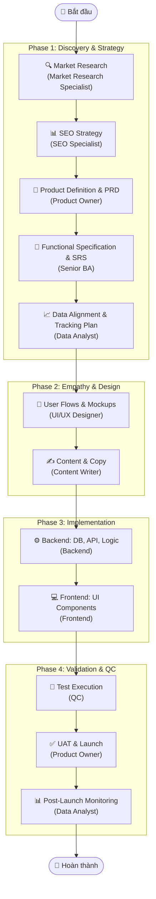
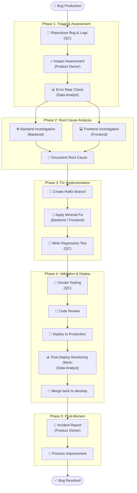
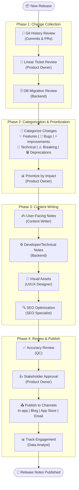

```mermaid
flowchart TD
    Start([🔬 Bắt đầu Nghiên cứu]) --> A1

    subgraph P1_Sub["Phase 1: Research Scope & Objectives"]
        direction TB
        A1["❓ Define Research Questions\n(Product Owner)"]
        A2["👥 Identify Target Segments"]
        A3["📋 Select Research Methods"]
        A1 --> A2 --> A3
    end

    A3 --> B1

    subgraph P2_Sub["Phase 2: Competitive Analysis"]
        direction TB
        B1["🏢 Competitor Identification\n(Market Research)"]
        B2["📊 Feature Matrix Comparison"]
        B3["💪 SWOT Analysis"]
        B4["⭐ App Store & Review Analysis"]
        B1 --> B2 --> B3 --> B4
    end

    B4 --> C1

    subgraph P3_Sub["Phase 3: User & Market Insights"]
        direction TB
        C1["🔍 Search Demand Analysis\n(SEO Specialist)"]
        C2["📈 Internal Data Analysis\n(Data Analyst)"]
        C3["💬 Social & Community Listening"]
        C4["📉 Trend Analysis"]
        C1 --> C2 --> C3 --> C4
    end

    C4 --> D1

    subgraph P4_Sub["Phase 4: Strategic Synthesis"]
        direction TB
        D1["🗺️ Opportunity Mapping\n(Market Research)"]
        D2["🎯 Positioning Strategy & UVP"]
        D3["✍️ Content Strategy Alignment\n(Content Writer)"]
        D4["💰 Pricing Insights"]
        D1 --> D2 --> D3 --> D4
    end

    D4 --> E1

    subgraph P5_Sub["Phase 5: Reporting & Action Items"]
        direction TB
        E1["📑 Research Report"]
        E2["📋 Backlog Prioritization\n(Product Owner)"]
        E3["🎨 Design Implications\n(UI/UX)"]
        E4["🎤 Stakeholder Presentation"]
        E1 --> E2 --> E3 --> E4
    end

    E4 --> End([📊 Báo cáo hoàn tất])
```

# 📋 Workflows

Tổng hợp các quy trình làm việc (workflows) được chuẩn hóa cho dự án. Mỗi workflow định nghĩa một chuỗi các bước có trật tự, sử dụng các **Agent chuyên biệt** để đảm bảo chất lượng đầu ra.

---

## Mục lục

| #   | Workflow                                                                                    | Lệnh               | Mô tả                                              |
| --- | ------------------------------------------------------------------------------------------- | ------------------ | -------------------------------------------------- |
| 1   | [Feature Development](#1-feature-development) · [Chi tiết](master/develop-feature.md)       | `/develop-feature` | Phát triển tính năng end-to-end theo Agile 4 phase |
| 2   | [Hotfix](#2-hotfix) · [Chi tiết](workflow/hotfix-workflow.md)                                 | `/hotfix`          | Xử lý bug nghiêm trọng trên production             |
| 3   | [Market Research](#3-market-research) · [Chi tiết](workflow/market-research-workflow.md)        | `/market-research` | Nghiên cứu thị trường & phân tích cạnh tranh       |
| 4   | [Refactor](#4-refactor) · [Chi tiết](workflow/refactor-workflow.md)                           | `/refactor`        | Cải tiến code & xử lý technical debt               |
| 5   | [Security Audit](#5-security-audit) · [Chi tiết](workflow/security-audit-workflow.md)           | `/security-audit`  | Kiểm tra bảo mật ASP.NET Core & SQL Server         |
| 6   | [Deploy](#6-deploy) · [Chi tiết](workflow/deploy-workflow.md)                                 | `/deploy`          | Triển khai sản phẩm lên production                 |
| 7   | [Commit & Push](#7-commit--push) · [Chi tiết](workflow/commit-push-workflow.md)               | `/commit-push`     | Chuẩn hóa quy trình đẩy code                       |
| 8   | [Release Notes](#8-release-notes) · [Chi tiết](workflow/release-notes-workflow.md)             | `/release-notes`   | Viết release notes chuyên nghiệp cho mỗi phiên bản |

### Tài liệu dùng chung

- [SRS_Template.md](SRS_Template.md) — mẫu đặc tả yêu cầu (SRS)
- [master/design-system.md](master/design-system.md) — design system
- [master/mcp.md](master/mcp.md) — MCP servers và mapping vai trò
- [skills/README.md](skills/README.md) — danh sách Agent skills

---

## 1. Feature Development

> **Lệnh**: `/develop-feature`  
> **Chi tiết**: [master/develop-feature.md](master/develop-feature.md)  
> **Mục đích**: Quy trình phát triển tính năng toàn diện theo mô hình Agile 4 phase — từ khám phá thị trường đến đảm bảo chất lượng.

### Các Phase

| Phase | Tên                      | Mục tiêu                                                                                      | Agents tham gia                                              |
| ----- | ------------------------ | --------------------------------------------------------------------------------------------- | ------------------------------------------------------------ |
| 1     | **Discovery & Strategy** | Nghiên cứu thị trường, định nghĩa sản phẩm (PRD), đặc tả yêu cầu (SRS), lập kế hoạch tracking | Market Research, SEO, Product Owner, Senior BA, Data Analyst |
| 2     | **Empathy & Design**     | Thiết kế UX/UI, viết nội dung                                                                 | UI/UX Designer, Content Writer                               |
| 3     | **Implementation**       | Xây dựng backend & frontend                                                                   | Backend, Frontend                                            |
| 4     | **Validation & QC**      | Kiểm thử, UAT, theo dõi sau launch                                                            | QC, Product Owner, Data Analyst                              |

### Activity Diagram

---

## 2. Hotfix

> **Lệnh**: `/hotfix`  
> **Chi tiết**: [workflow/hotfix-workflow.md](workflow/hotfix-workflow.md)  
> **Mục đích**: Quy trình xử lý bug nghiêm trọng trên production một cách nhanh chóng và có kiểm soát, đảm bảo thời gian downtime tối thiểu.

### Các Phase

| Phase | Tên                     | Mục tiêu                                   | Agents tham gia                 |
| ----- | ----------------------- | ------------------------------------------ | ------------------------------- |
| 1     | **Triage & Assessment** | Tái hiện bug, đánh giá mức độ ảnh hưởng    | QC, Product Owner, Data Analyst |
| 2     | **Root Cause Analysis** | Xác định nguyên nhân gốc                   | Backend, Frontend               |
| 3     | **Fix Implementation**  | Tạo branch hotfix, sửa lỗi, viết test      | Backend / Frontend, QC          |
| 4     | **Validation & Deploy** | Smoke test, code review, deploy production | QC, Data Analyst                |
| 5     | **Post-Mortem**         | Tổng kết sự cố, cải tiến quy trình         | Product Owner                   |

### Activity Diagram

---

## 3. Market Research

> **Lệnh**: `/market-research`  
> **Chi tiết**: [workflow/market-research-workflow.md](workflow/market-research-workflow.md)  
> **Mục đích**: Quy trình nghiên cứu thị trường toàn diện — từ phân tích đối thủ, hành vi người dùng đến chiến lược định vị sản phẩm.

### Các Phase

| Phase | Tên                        | Mục tiêu                                                  | Agents tham gia                    |
| ----- | -------------------------- | --------------------------------------------------------- | ---------------------------------- |
| 1     | **Research Scope**         | Xác định câu hỏi nghiên cứu, phân khúc, phương pháp       | Product Owner                      |
| 2     | **Competitive Analysis**   | Phân tích đối thủ, SWOT, feature matrix                   | Market Research Specialist         |
| 3     | **User & Market Insights** | Phân tích search demand, dữ liệu nội bộ, social listening | SEO, Data Analyst                  |
| 4     | **Strategic Synthesis**    | Opportunity mapping, UVP, chiến lược nội dung & giá       | Market Research, Content Writer    |
| 5     | **Reporting & Action**     | Báo cáo, cập nhật backlog, trình bày stakeholder          | Product Owner, UI/UX, Data Analyst |

### Activity Diagram

---

## 4. Refactor

> **Lệnh**: `/refactor`  
> **Chi tiết**: [workflow/refactor-workflow.md](workflow/refactor-workflow.md)  
> **Mục đích**: Quy trình cải tiến cấu trúc code mà không thay đổi hành vi bên ngoài, giúp giảm nợ kỹ thuật và tăng tính bảo trì.

### Các Phase

| Phase | Tên                          | Mục tiêu                                | Agents tham gia         |
| ----- | ---------------------------- | --------------------------------------- | ----------------------- |
| 1     | **Analysis & Scoping**       | Xác định hotspot, nợ kỹ thuật & rủi ro  | Backend, Frontend, PO   |
| 2     | **Implementation**           | Thực hiện cleanup, cấu trúc lại code    | Backend, Frontend       |
| 3     | **Validation & Performance** | Kiểm thử hồi quy, đo lường hiệu năng    | QC, Data Analyst, UI/UX |
| 4     | **Sign-off & Merge**         | Review chéo và tích hợp vào main branch | Master Agent            |

---

## 5. Security Audit

> **Lệnh**: `/security-audit`  
> **Chi tiết**: [workflow/security-audit-workflow.md](workflow/security-audit-workflow.md)  
> **Mục đích**: Đảm bảo an toàn cho dự án, tập trung vào bảo mật ASP.NET Core Identity, Authorization Policy, input validation (FluentValidation), và bảo mật dữ liệu SQL Server.

### Các Phase

| Phase | Tên                          | Mục tiêu                                        | Agents tham gia           |
| ----- | ---------------------------- | ----------------------------------------------- | ------------------------- |
| 1     | **Policy Review**            | Kiểm tra RLS policies & permissions             | Backend                   |
| 2     | **Vulnerability Assessment** | Tìm kiếm lỗ hổng bảo mật layer backend/frontend | Master, Backend, Frontend |
| 3     | **Hardening**                | Áp đặt chính sách bảo mật chặt chẽ hơn          | Backend                   |
| 4     | **Verification**             | Kiểm tra phân quyền theo vai trò (Roles)        | QC, Backend               |

---

## 6. Deploy

> **Lệnh**: `/deploy`  
> **Chi tiết**: [workflow/deploy-workflow.md](workflow/deploy-workflow.md)  
> **Mục đích**: Quy trình triển khai sản phẩm lên môi trường production một cách an toàn và có kiểm soát.

### Các Phase

| Phase | Tên                      | Mục tiêu                              | Agents tham gia |
| ----- | ------------------------ | ------------------------------------- | --------------- |
| 1     | **Pre-deployment**       | Kiểm tra DB, Env vars và UAT sign-off | Backend, PO     |
| 2     | **Build & Verification** | Build production và smoke test        | QC, SEO         |
| 3     | **Deployment**           | Push to production & Tagging version  | Master          |
| 4     | **Post-deployment**      | Theo dõi lỗi và hiệu năng sau launch  | Data Analyst    |

---

## 7. Commit & Push

> **Lệnh**: `/commit-push`  
> **Chi tiết**: [workflow/commit-push-workflow.md](workflow/commit-push-workflow.md)  
> **Mục đích**: Chuẩn hóa quy trình đẩy code lên repository, đảm bảo lịch sử git sạch và code chất lượng.

### Các Phase

| Phase | Tên                 | Mục tiêu                                      | Agents tham gia   |
| ----- | ------------------- | --------------------------------------------- | ----------------- |
| 1     | **Pre-flight**      | Lint, Format và Test nội bộ                   | Backend, Frontend |
| 2     | **Standardization** | Viết commit message theo chuẩn Conventional   | Toàn bộ           |
| 3     | **Remote Push**     | Rebase và đẩy code lên remote                 | Toàn bộ           |
| 4     | **PR Prep**         | Chuẩn bị nội dung Pull Request và link ticket | Toàn bộ           |

---

## 8. Release Notes

> **Lệnh**: `/release-notes`  
> **Chi tiết**: [workflow/release-notes-workflow.md](workflow/release-notes-workflow.md)  
> **Mục đích**: Quy trình viết release notes chuyên nghiệp, đảm bảo mọi thay đổi được ghi nhận và truyền tải rõ ràng tới từng đối tượng (người dùng, dev, stakeholder).

### Các Phase

| Phase | Tên                   | Mục tiêu                                             | Agents tham gia                     |
| ----- | --------------------- | ---------------------------------------------------- | ----------------------------------- |
| 1     | **Change Collection** | Thu thập tất cả thay đổi từ Git, Linear, DB          | Product Owner, Backend              |
| 2     | **Categorization**    | Phân loại: Feature, Bugfix, Improvement, Breaking... | Product Owner                       |
| 3     | **Content Writing**   | Viết nội dung user-facing & technical notes          | Content Writer, Backend, UI/UX, SEO |
| 4     | **Review & Publish**  | Kiểm tra chính xác, phê duyệt, phân phối             | QC, Product Owner, Data Analyst     |

### Activity Diagram

---

## Workflows bổ sung (master/)

Các quy trình kỹ thuật và điều phối bổ sung — xem [skills/README.md](skills/README.md) để biết Agent tương ứng.

| File | Mô tả |
| ---- | ----- |
| [feature-kickoff-workflow.md](workflow/feature-kickoff-workflow.md) | Pipeline ý tưởng → SRS → DB → API → sequence → test prep |
| [feature-spec-generation.md](master/feature-spec-generation.md) | PM + BA + UX → SRS |
| [database-schema-workflow.md](workflow/database-schema-workflow.md) | BA ↔ Backend thiết kế database |
| [sequence-diagram-workflow.md](workflow/sequence-diagram-workflow.md) | Sequence diagram Mermaid |
| [market_onepager_workflow.md](workflow/market_onepager_workflow.md) | One-pager thị trường |
| [project_onepager_synthesis.md](master/project_onepager_synthesis.md) | Tổng hợp onepager + dự án |
| [design-system.md](master/design-system.md) | Design system |
| [mcp.md](master/mcp.md) | MCP servers, server ID, mapping vai trò |

---

## Agents tham gia

Danh sách các Agent chuyên biệt được sử dụng xuyên suốt các workflow. Bảng đầy đủ: [skills/README.md](skills/README.md).

| Agent | Vai trò chính |
| ----- | ------------- |
| 🏛️ [Principal AI Architect](skills/principal-ai-architect/SKILL.md) | Đánh giá kiến trúc, spec mới, tối ưu hệ thống |
| 🤖 [Senior AI Engineer](skills/senior-ai-engineer/SKILL.md) | RAG, agentic workflows, AI tracing |
| 🧑‍💼 [Senior Product Owner](skills/senior-po/SKILL.md) | PRD, User Stories, UAT, ra quyết định |
| 📜 [Senior Business Analyst](skills/senior-ba/SKILL.md) | SRS ([SRS_Template.md](SRS_Template.md)), logic flow, BDD AC |
| 🔍 [Senior Market Research Specialist](skills/senior-market-research-specialist/SKILL.md) | Phân tích thị trường, đối thủ |
| 📊 [Senior SEO Specialist](skills/senior-seo-specialist/SKILL.md) | Keyword research, search intent, SEO |
| 🎨 [Senior UI/UX Designer](skills/senior-uiux/SKILL.md) | User flows, mockups, [design system](master/design-system.md) |
| ✍️ [Senior Content Writer](skills/senior-content-writer/SKILL.md) | Copywriting, brand voice |
| ⚙️ [Senior Backend](skills/senior-backend/SKILL.md) | API, database, business logic |
| 💻 [Senior Frontend](skills/senior-frontend/SKILL.md) | UI components, client integration |
| 🧪 [Senior QC](skills/senior-qc/SKILL.md) | Testing strategy, regression tests |
| 📈 [Senior Data Analyst](skills/senior-data-analyst/SKILL.md) | Analytics, tracking plans, dashboards |
| 🚀 [Senior DevOps/MLOps](skills/senior-devops-mlops/SKILL.md) | CI/CD, deploy, AI quality gates |
| 🛠️ [Senior Architect .NET](skills/senior-architect-dotnet/SKILL.md) | Clean Architecture, CQRS, MediatR |
| 🗄️ [Senior EF Core](skills/senior-efcore/SKILL.md) | EF Core, Migrations, Repository Pattern |
| 📨 [Senior Integration](skills/senior-integration/SKILL.md) | Email (MailKit), Zalo OA API, Hangfire |
| 🚧 [Senior DevOps .NET](skills/senior-devops-dotnet/SKILL.md) | GitHub Actions, IIS/Azure deploy, EF migration |
| 📊 [Senior Logging](skills/senior-logging/SKILL.md) | Serilog, Health Checks, Observability |

---

## MCP trong Cursor

Các workflow và Agent nên dùng MCP đã kết nối (Browser, PostHog). Xem **[master/mcp.md](master/mcp.md)** để biết server ID, quy tắc gọi tool và mapping vai trò.