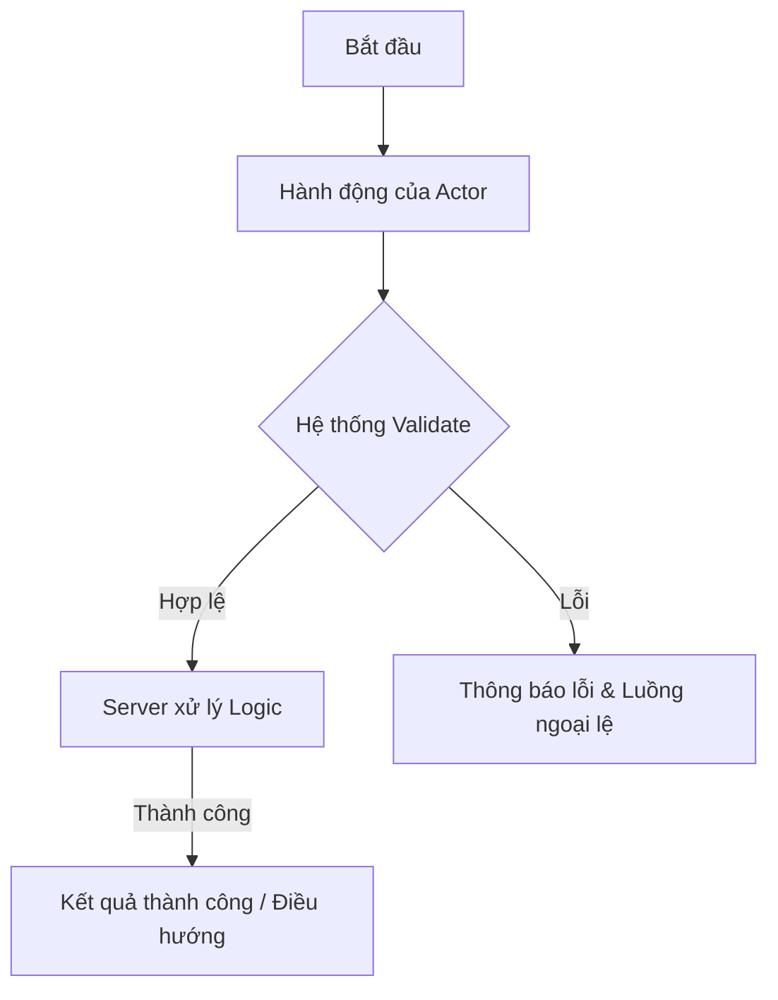

```
---
type: SRS
feature_id: FEAT-001
status: DRAFT
target_agents: ["senior-ba-specialist", "senior-backend", "senior-qa-qc"]
---
```

# 📄 ĐẶC TẢ YÊU CẦU CHỨC NĂNG (SRS)

## 1. Thông tin chung (General Information)

- **Tên chức năng / Usecase**: {{FEATURE_NAME}}
- **Tác nhân (Actor)**: {{ACTORS}}
- **Mục tiêu (Goal)**: {{GOAL_DESCRIPTION}}

## 2. User Story (Agile Standard)

**Là một** {{ACTOR}}, **tôi muốn** {{ACTION}}, **để tôi có thể** {{BENEFIT}}.

## 3. Yêu cầu chức năng (Functional Requirements)

|      ID      | Tính năng     | Mô tả chi tiết |
| :----------: | :-------------- | :---------------- |
| **F1** | {{FUNC_NAME_1}} | {{FUNC_DESC_1}}   |
| **F2** | {{FUNC_NAME_2}} | {{FUNC_DESC_2}}   |

## 4. Yêu cầu phi chức năng (Non-Functional Requirements)

| Nhóm yêu cầu         | Tiêu chuẩn kỹ thuật |
| :---------------------- | :---------------------- |
| **Security**      | {{SECURITY_REQ}}        |
| **Performance**   | {{PERFORMANCE_REQ}}     |
| **Reliability**   | {{RELIABILITY_REQ}}     |
| **Compatibility** | {{COMPATIBILITY_REQ}}   |
| **Usability**     | {{USABILITY_REQ}}       |

## 5. Luồng sự kiện (Flow of Events)

### 3.1. Luồng chính (Happy Path)

- **Bước 1**: {{STEP_1_DESCRIPTION}}
- **Bước 2**: {{STEP_2_DESCRIPTION}}
- **Bước 3**: {{STEP_3_ACTION_BY_ACTOR}}
- **Bước 4**: Hệ thống (Client) kiểm tra tính hợp lệ của dữ liệu đầu vào (UI Validation).
  - **Ngoại lệ (Alternative)**: Nếu dữ liệu không hợp lệ, {{ERROR_HANDLING_UI}} và dừng luồng.
- **Bước 5**: Client gửi yêu cầu (Request) lên Server/Service.
- **Bước 6**: Hệ thống (Server) xử lý nghiệp vụ:
  - **Bước 6.1 (Thành công - Happy Path)**: {{SUCCESS_LOGIC_AND_REDIRECT}}
  - **Bước 6.2 (Thất bại - Exception Flow)**: {{SERVER_ERROR_HANDLING_AND_MSG}}

### 3.2. Luồng ngoại lệ / Rẽ nhánh khác (Alternative Flows)

- **{{FLOW_NAME}}**:
  - **Bước 1**: {{ALT_STEP_1}}
  - **Bước 2**: {{ALT_STEP_2}}
  - **Ngoại lệ**: {{ALT_EXCEPTION_HANDLING}}

### 3.3. Flowchart (Mermaid)



## 6. Tiêu chí nghiệm thu (Acceptance Criteria - BDD Format)

### Scenario 1

- **Given**: {{PRE_CONDITION}}
- **When**: {{ACTION}}
- **Then**: {{EXPECTED_RESULT}}
- **And**: {{ADDITIONAL_RESULT}}

## 7. Quy tắc nghiệp vụ & Kỹ thuật (Business & Technical Rules)

| Phân vùng            | Quy tắc xử lý |
| ---------------------- | ---------------- |
| **{{DOMAIN_1}}** | {{RULE_1}}       |
| **{{DOMAIN_2}}** | {{RULE_2}}       |

## 8. UI/UX Validation (Ràng buộc giao diện)

- **Validation**: {{FIELD_VALIDATION_RULES}}
- **States**:
  - `isLoading`: {{LOADING_BEHAVIOR}}
  - `Empty/Error`: {{ERROR_EMPTY_STATES}}
- **UX Polish**: {{ANIMATION_TRANSITION_DETAILS}}

## 9. Danh mục dữ liệu (Data Dictionary)

|  Trường dữ liệu  | Loại dữ liệu | Bắt buộc | Ràng buộc / Validation | Nguồn / Lưu trữ |
| :-------------------: | :-------------: | :--------: | :----------------------: | :----------------: |
| **{{FIELD_1}}** |   {{TYPE_1}}   | {{REQ_1}} |     {{VALIDATION_1}}     |   {{STORAGE_1}}   |
| **{{FIELD_2}}** |   {{TYPE_2}}   | {{REQ_2}} |     {{VALIDATION_2}}     |   {{STORAGE_2}}   |


## 10 Danh Mục tracking Event

```
 Tên Sự kiện (Event Name) | Điều kiện kích hoạt (Trigger) | Thuộc tính đi kèm (Properties) |
| :--- | :--- | :--- |
| `{{EVENT_1}}` | {{TRIGGER_CONDITION}} | `{"user_id": "", "action": ""}` |
```
