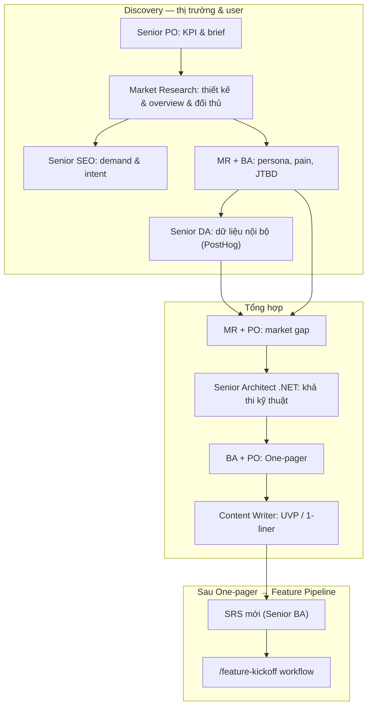

# Tổng hợp One-pager thị trường & Agent Map

Tài liệu này nối **[market_onepager_workflow.md](../workflow/market_onepager_workflow.md)** với **dự án hiện tại** (ASP.NET Core API + MVC, quản lý hội viên/membership) và **bộ Agent skills** trong [.agents/skills/README.md](../skills/README.md).

**Mục tiêu:** Team chạy một vòng discovery thị trường có trật tự — biết gọi agent nào ở bước nào — và ra được One-pager đủ 6 khối (market overview, gap, competitor, user target, pain, JTBD) gắn với sản phẩm thực tế.

---

## 1. Bối cảnh sản phẩm

| Khía cạnh | Mô tả |
| --- | --- |
| **Tên dự án** | Hệ thống Quản lý Hội viên (Membership Management System) |
| **Stack** | ASP.NET Core 8 API · MVC Razor Views · SQL Server · EF Core · Hangfire · Bootstrap 5 |
| **Giá trị cốt lõi** | Đăng ký hội viên, phê duyệt/từ chối, quản lý gói dịch vụ, thông báo Email & Zalo OA, báo cáo thống kê |
| **Kiến trúc** | Clean Architecture · CQRS (MediatR) · Repository Pattern · FluentValidation |
| **Tài liệu kỹ thuật** | SRS trong `.docs/specs/`, Workflow trong `.agents/workflow/` |
| **Quy trình tổng thể** | [.agents/README.md](../README.md) — Feature Development 6 phase, `/feature-kickoff` pipeline |

---

## 2. One-pager workflow ↔ Agent Map

Các bước trong `market_onepager_workflow.md` được gắn **agent phụ trợ** phù hợp với stack .NET và domain hội viên.

| Bước (workflow) | Agent chính | Agents bổ trợ / Tool | Output gợi ý cho dự án |
| --- | --- | --- | --- |
| **0 Discovery brief** | Senior PO | DA (PostHog nếu có baseline) | KPI: conversion đăng ký → phê duyệt, retention gói, churn rate |
| **1 Thiết kế nghiên cứu** | Senior Market Research | Senior SEO (search demand) | Bảng câu hỏi → nguồn: hiệp hội, CLB, trung tâm dịch vụ hội viên VN |
| **2 Market overview** | Senior Market Research | SEO, Content | Quy mô thị trường hội viên, xu hướng số hóa quản lý hội viên |
| **3 Competitor** | Senior Market Research | SEO (SERP gap) | Ma trận: phần mềm quản lý hội viên, CRM nội địa, Excel thủ công |
| **4 User target** | MR + **Senior BA** | UI/UX (persona sketch) | Persona: Ban quản lý hội, thành viên, nhân viên hành chính |
| **5 Pain points** | Senior Market Research | DA (feedback/support log), QC | Pain: xử lý đơn thủ công, thông báo chậm, dữ liệu phân tán |
| **6 JTBD** | **Senior BA** + MR | PO (business jobs) | JTBD: quản lý gói dịch vụ, tự động hóa thông báo, báo cáo nhanh |
| **7 Market gap** | MR + Senior PO | **Senior Architect .NET** (khả thi kỹ thuật) | Gap: tự động hóa workflow phê duyệt, tích hợp Zalo OA, real-time dashboard |
| **8 Tổng hợp One-pager** | Senior BA + Senior PO | Content Writer (UVP), SEO | Bản chốt 1 trang + 3–5 action vào backlog → SRS mới |

**Sau One-pager:** [Senior Architect .NET](../skills/senior-architect-dotnet/SKILL.md) đánh giá tính khả thi kỹ thuật và đề xuất architecture blueprint cho tính năng mới được phát hiện qua research.

---

## 3. Nối với workflow có sẵn trong `.agents/`

| Workflow | Chỗ khớp One-pager |
| --- | --- |
| **/market-research** Phase 1–5 | Phase 1 = Bước 0–1; Phase 2 ≈ 3; Phase 3 ≈ user/market insight; Phase 4 ≈ 7; Phase 5 = Bước 8 + backlog |
| **Feature Development** Phase 1 (Discovery) | MR, SEO, PO, BA, DA — cùng nguồn insight với One-pager |
| **Feature Development** Phase 2 (Architecture) | Senior Architect .NET dùng insight từ One-pager để thiết kế kiến trúc tính năng mới |
| **Feature Development** Phase 3–5 | Implementation → EF Core, Backend, Frontend, Integration, Logging, DevOps |
| **/feature-kickoff** Bước 1–7 | Bộ pipeline đầy đủ từ SRS → Architecture Blueprint → ERD → API Spec → Test Plan → Deploy |

---

## 4. Sơ đồ: vòng One-pager cho dự án

---

## 5. Gợi ý điền nhanh từng khối One-pager (theo domain hội viên)

Dùng làm **dữ liệu khởi đầu**; thay bằng số liệu thật sau research.

| Khối One-pager | Góc nhìn Hội viên / Membership |
| --- | --- |
| **Market overview** | Thị trường quản lý hội viên VN; xu hướng số hóa hội/CLB/trung tâm; tự động hóa thay Excel |
| **Market gap** | Thiếu tích hợp thông báo Zalo OA; phê duyệt thủ công chậm; báo cáo real-time |
| **Competitor** | Phần mềm CRM nội địa, Google Forms + Sheet, hệ thống in-house thủ công |
| **User target** | Ban quản lý: cần dashboard nhanh · Nhân viên: cần workflow rõ · Hội viên: cần portal tự đăng ký |
| **Pain points** | Xử lý đơn thủ công mất thời gian · Thông báo chậm/thiếu · Dữ liệu phân tán không truy vấn được |
| **JTBD** | Khi [quản lý lượng hội viên lớn] muốn [tự động hóa phê duyệt + thông báo] để [tiết kiệm nhân lực + tăng chuyên nghiệp] |

---

## 6. MCP & dữ liệu (gợi ý thực thi)

| MCP / Tool | Ai dùng | Việc |
| --- | --- | --- |
| `posthog` MCP | PO, DA | Funnel đăng ký → phê duyệt; page views; session replay |
| `browser` MCP | QC, FE | Smoke test UI sau deploy; hành vi thực tế trên Razor Views |
| Web Search | SEO, MR | Demand từ khóa quản lý hội viên, membership software VN |
| SQL Server / SSMS | Backend, EF Core | Phân tích dữ liệu nội bộ (không lộ PII ra One-pager) |
| Hangfire Dashboard `/hangfire` | Backend, DevOps | Kiểm tra job notification chạy đúng sau research → implement |

> **Lưu ý:** Không còn dùng `supabase` MCP hay `vercel` MCP. Xem [mcp.md](mcp.md) để biết danh sách MCP hiện tại.

---

## 7. Checklist "đủ để chốt" One-pager

- [ ] Brief PO có KPI rõ (conversion rate, thời gian xử lý đơn, tỷ lệ thông báo thành công).
- [ ] MR: ít nhất 3 đối thủ/giải pháp thay thế + feature matrix.
- [ ] SEO: ít nhất 1 góc search intent ánh xạ đến tính năng sản phẩm.
- [ ] BA: persona + JTBD tách biệt pain; thuật ngữ thống nhất với SRS sau này.
- [ ] DA: 1 đoạn đối chiếu insight với số nội bộ (hoặc ghi rõ "chưa có dữ liệu").
- [ ] Architect .NET: xác nhận gap có thể implement với stack hiện tại (ASP.NET Core + EF Core + Hangfire).
- [ ] PO + BA: One-pager 1 trang + 3–5 hành động vào backlog / SRS mới.
- [ ] Content: UVP/one-liner rõ ràng cho landing page hoặc email giới thiệu.

---

## 8. Liên kết tài liệu

- [market_onepager_workflow.md](../workflow/market_onepager_workflow.md) — bước chi tiết và khung 10 mục.
- [develop-feature.md](develop-feature.md) — quy trình phát triển 6 phase (có 5 skills .NET mới).
- [feature-kickoff-workflow.md](../workflow/feature-kickoff-workflow.md) — pipeline `/feature-kickoff` 7 bước.
- [.agents/skills/README.md](../skills/README.md) — danh sách đầy đủ Agent skills + hướng dẫn chọn.
- [mcp.md](mcp.md) — MCP servers hiện tại (Browser, PostHog).
