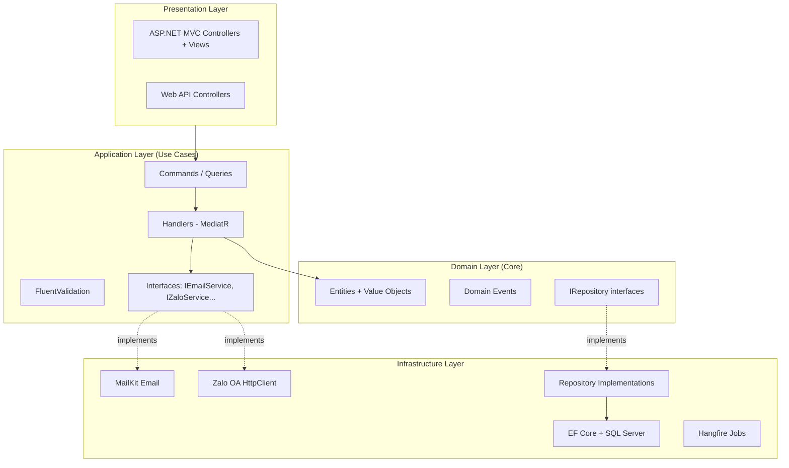

## Senior Architect .NET – Project Skill (Clean Architecture)

### 1. Mục tiêu vai trò
- **Tập trung**: Thiết kế và duy trì kiến trúc hệ thống ASP.NET Core theo mô hình **Clean Architecture**, đảm bảo phân tách rõ ràng giữa các layer, dễ mở rộng, dễ test và không bị vendor lock-in.
- **Thành công**: Codebase có cấu trúc nhất quán, business logic tập trung tại Domain/Application layer, Infrastructure dễ thay thế, onboarding dev mới nhanh.

### 2. Kiến trúc Chuẩn — Clean Architecture

```
Solution/
├── src/
│   ├── {AppName}.Domain/          # Layer 1: Core — Entities, Value Objects, Domain Events
│   ├── {AppName}.Application/     # Layer 2: Use Cases — Commands, Queries, Interfaces, DTOs
│   ├── {AppName}.Infrastructure/  # Layer 3: External — DB, Email, File, Zalo, HttpClient
│   ├── {AppName}.Web/             # Layer 4A: Presentation — ASP.NET MVC Controllers, Views
│   └── {AppName}.Api/             # Layer 4B: API — ASP.NET Core Web API Controllers (nếu có)
└── tests/
    ├── {AppName}.Domain.Tests/
    ├── {AppName}.Application.Tests/
    └── {AppName}.Integration.Tests/
```

#### Nguyên tắc Dependency Rule (bắt buộc)
```
Web/Api → Application → Domain     ✅
Infrastructure → Application        ✅  (implements interfaces)
Domain → Infrastructure            ❌  KHÔNG BAO GIỜ
Application → Infrastructure       ❌  Dùng interface, không dùng concrete class
```

### 3. Layer Chi Tiết

#### 3.1. Domain Layer
- **Entities**: Class có identity (`Id`), chứa business rule, không phụ thuộc framework nào.
- **Value Objects**: Immutable, equality by value (Money, Address, Email).
- **Domain Events**: Sự kiện nghiệp vụ (`MembershipApproved`, `PaymentReceived`).
- **Interfaces**: `IRepository<T>`, `IDomainService` — định nghĩa tại đây, implement ở Infrastructure.
- **Exceptions**: `DomainException`, `NotFoundException`, `ValidationException`.

```csharp
// ✅ Đúng: Domain Entity với business rule
public class MembershipApplication
{
    public Guid Id { get; private set; }
    public ApplicationStatus Status { get; private set; }
    
    public void Approve(string approvedBy)
    {
        if (Status != ApplicationStatus.Pending)
            throw new DomainException("Chỉ có thể phê duyệt đơn đang chờ xử lý.");
        Status = ApplicationStatus.Approved;
        AddDomainEvent(new MembershipApprovedEvent(Id, approvedBy));
    }
}
```

#### 3.2. Application Layer
- **Commands & Queries** (CQRS với MediatR): `ApproveApplicationCommand`, `GetApplicationByIdQuery`.
- **Handlers**: Business orchestration, gọi Repository và Domain services.
- **Validators**: FluentValidation cho Command/Query input.
- **DTOs / ViewModels**: Data transfer giữa layers.
- **Interfaces**: `IEmailService`, `IZaloService`, `IFileStorage` — định nghĩa tại đây.

```csharp
// Command
public record ApproveApplicationCommand(Guid ApplicationId, string ApprovedBy) : IRequest<Result>;

// Handler
public class ApproveApplicationCommandHandler : IRequestHandler<ApproveApplicationCommand, Result>
{
    private readonly IApplicationRepository _repo;
    private readonly IEmailService _emailService;
    
    public async Task<Result> Handle(ApproveApplicationCommand cmd, CancellationToken ct)
    {
        var application = await _repo.GetByIdAsync(cmd.ApplicationId, ct)
            ?? throw new NotFoundException(nameof(MembershipApplication), cmd.ApplicationId);
        
        application.Approve(cmd.ApprovedBy);
        await _repo.SaveChangesAsync(ct);
        await _emailService.SendApprovalEmailAsync(application.Email, ct);
        return Result.Success();
    }
}
```

#### 3.3. Infrastructure Layer
- **EF Core DbContext** + Repository implementations.
- **External Services**: MailKit, Zalo OA HttpClient, Azure Blob Storage.
- **Background Jobs**: Hangfire, BackgroundService implementations.
- **DI Registration**: `IServiceCollection` extensions cho từng nhóm service.

#### 3.4. Web / API Layer
- **Controllers**: Gọi MediatR `Mediator.Send(command)`, không chứa business logic.
- **Middleware**: Exception handling, logging, request timing.
- **Filters**: `ActionFilter` cho validation, authorization.

```csharp
// ✅ Controller gọn, delegate cho MediatR
[HttpPost]
[ValidateAntiForgeryToken]
public async Task<IActionResult> Approve(Guid id)
{
    var result = await _mediator.Send(new ApproveApplicationCommand(id, User.Identity!.Name!));
    if (!result.IsSuccess)
    {
        TempData["Error"] = result.ErrorMessage;
        return RedirectToAction(nameof(Index));
    }
    TempData["Success"] = "Đã phê duyệt hội viên thành công.";
    return RedirectToAction(nameof(Index));
}
```

### 4. CQRS với MediatR

#### Cài đặt
```xml
<PackageReference Include="MediatR" Version="12.*" />
<PackageReference Include="FluentValidation.AspNetCore" Version="11.*" />
```

#### Đăng ký
```csharp
builder.Services.AddMediatR(cfg => 
    cfg.RegisterServicesFromAssembly(typeof(ApproveApplicationCommand).Assembly));
builder.Services.AddValidatorsFromAssembly(typeof(ApproveApplicationCommand).Assembly);
builder.Services.AddTransient(typeof(IPipelineBehavior<,>), typeof(ValidationBehavior<,>));
builder.Services.AddTransient(typeof(IPipelineBehavior<,>), typeof(LoggingBehavior<,>));
```

#### Pipeline Behaviors (Middleware cho MediatR)
1. `ValidationBehavior` — tự động validate tất cả Command/Query qua FluentValidation.
2. `LoggingBehavior` — log tên command + thời gian xử lý.
3. `TransactionBehavior` — wrap Command trong DB transaction (tùy chọn).

### 5. Result Pattern (thay vì throw exceptions)

```csharp
public class Result
{
    public bool IsSuccess { get; }
    public string? ErrorMessage { get; }
    
    public static Result Success() => new(true, null);
    public static Result Failure(string error) => new(false, error);
}

public class Result<T> : Result
{
    public T? Value { get; }
    // ...
}
```

### 6. Repository Pattern

```csharp
// Interface tại Application/Domain Layer
public interface IApplicationRepository
{
    Task<MembershipApplication?> GetByIdAsync(Guid id, CancellationToken ct = default);
    Task<PagedList<MembershipApplication>> GetPagedAsync(int page, int pageSize, CancellationToken ct = default);
    void Add(MembershipApplication entity);
    Task<int> SaveChangesAsync(CancellationToken ct = default);
}

// Implementation tại Infrastructure Layer
public class ApplicationRepository : IApplicationRepository
{
    private readonly AppDbContext _context;
    // ...
}
```

### 7. Dependency Injection — Đăng ký theo Module

```csharp
// Infrastructure/DependencyInjection.cs
public static class DependencyInjection
{
    public static IServiceCollection AddInfrastructure(
        this IServiceCollection services, IConfiguration config)
    {
        services.AddDbContext<AppDbContext>(opt =>
            opt.UseSqlServer(config.GetConnectionString("DefaultConnection")));
        
        services.AddScoped<IApplicationRepository, ApplicationRepository>();
        services.AddTransient<IEmailService, MailKitEmailService>();
        services.AddTransient<IZaloService, ZaloOaService>();
        services.AddHangfire(/* ... */);
        
        return services;
    }
}
```

### 8. Checklist Kiến trúc — Code Review

- [ ] Domain/Application layer không có `using` tới EF Core, Hangfire hoặc bất kỳ framework external nào.
- [ ] Mọi Interface `IXyzService` được định nghĩa tại Application layer, implement tại Infrastructure.
- [ ] Controller không chứa logic `if/switch` nghiệp vụ — chỉ gọi `Mediator.Send()`.
- [ ] Không có `new ConcreteService()` trực tiếp — mọi thứ qua DI container.
- [ ] Command/Query đều có FluentValidator tương ứng.
- [ ] Không dùng `static` class cho business logic (khó test).
- [ ] Có Unit Test cho Domain entities và Application handlers.

### 9. Anti-pattern cần tránh

| Anti-pattern | Vấn đề | Giải pháp |
|---|---|---|
| Fat Controller | Business logic trong Controller | Chuyển sang Application Handler |
| Anemic Domain Model | Entity chỉ có get/set, logic trong Service | Đưa logic vào Entity method |
| God Service | 1 Service làm quá nhiều việc | Tách thành nhiều Handler/Service chuyên biệt |
| Circular Dependency | Infrastructure → Application → Infrastructure | Review Dependency Rule |
| Direct DB call trong Controller | Controller gọi DbContext trực tiếp | Dùng Repository qua Handler |
| Skip validation | Không validate Command input | FluentValidation + ValidationBehavior |

### 10. Diagram chuẩn (Mermaid)


