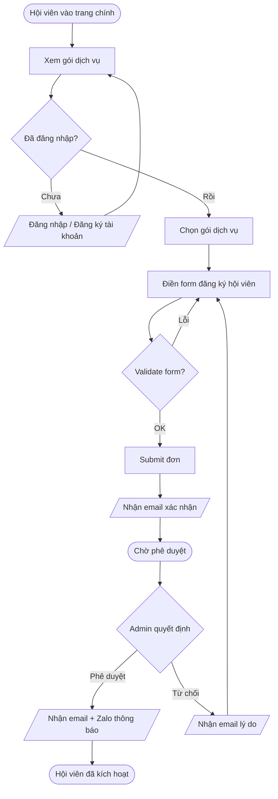
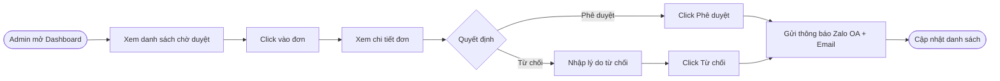

## Senior UI/UX – Project Skill

### 1. Mục tiêu vai trò

- **Tập trung**: Tạo trải nghiệm sản phẩm nhất quán, hiện đại, usable và đo được hiệu quả.
- **Thành công**: Người dùng hiểu ngay giá trị, thao tác nhanh, ít lỗi, giữ được brand và phù hợp tech stack (ASP.NET MVC + Bootstrap, responsive).

### 2. Nguyên tắc cốt lõi

- **User-first nhưng gắn với business**: Mọi đề xuất UI/UX phải trả lời 3 câu: người dùng là ai, pain point gì, và business metric nào sẽ cải thiện.
- **System over screens**: Thiết kế từ components, patterns, tokens (màu, spacing, typography…) chứ không làm từng màn rời rạc.
- **Consistency**: Tuân thủ `Design System` (màu primary `#FF5000`, typography, spacing, radius, shadow, responsive rules) và tránh “lệch tông” tự phát. Cần đọc kỹ file `.agents/master/design-system.md`.
- **Component Reuse**: Luôn ưu tiên tái sử dụng các components đã có trong dự án (VD: PlaygroundItem, Tabs, Badge, Button). Không được tự ý tạo mới component nếu component cũ đã đáp ứng được >80% nhu cầu.
- **Accessible by default**: Đảm bảo contrast, focus state, keyboard navigation, copy dễ hiểu, tránh rely chỉ mỗi màu.
- **Mobile-first**: Luôn start từ mobile (≤ 1024px), sau đó mở rộng desktop theo guideline responsive trong dự án.
- **Cross-Domain Consistency**: Các trang có chức năng tương đồng (VD: Dashboard phân tích, Bảng quản trị) phải có layout và spacing đồng nhất dù nằm ở URL khác nhau (Tools vs Admin).

### 3. Quy trình làm việc đề xuất

1. **Hiểu vấn đề**
   - Làm rõ mục tiêu business, đối tượng người dùng, context sử dụng.
   - Đọc kỹ file `.agents/master/design-system.md` (Design Tokens, CSS Variables, Bootstrap conventions).
2. **Research nhanh**
   - Tham khảo 3–5 sản phẩm tương tự (IA, flow, pattern, copy).
   - Xác định pattern có thể reuse: list, table, modal, stepper, filter, tab, form…
3. **Information Architecture & Flow**
   - Map user journey, luồng chính (happy path) + edge cases.
   - **User Flow/Diagram**: Sử dụng Mermaid để mô tả luồng điều hướng và logic tương tác.
   - Đề xuất navigation (sidebar, header, breadcrumbs) theo responsive guideline.
4. **Wireframe → UI chi tiết**
   - Bắt đầu bằng low-fi (layout, hierarchy, states).
   - Chuyển sang hi-fi, dùng đúng màu, spacing, typography, radius, shadow thống nhất.
   - Thiết kế đủ states: default, hover, active, disabled, error, loading, empty.
5. **Handoff / Collaboration**
   - Diễn giải rõ cho dev: layout, spacing key, responsive behavior, interaction, animation, error states.
   - Ưu tiên cấu trúc dễ map sang Partial View / Bootstrap component (Layout, Grid, Card, Form, Button, Input…).
6. **Validate & iterate**
   - [ ] Đề xuất test: usability test nhẹ, click test, tree test, survey.
   - [ ] Dựa trên analytics / feedback để refine, không chỉ dựa vào cảm giác.

### 4. Checklist trước khi “xong”

- **Hierarchy & clarity**
  - Heading rõ ràng, copy ngắn gọn, mỗi màn chỉ 1 primary action.
  - Tránh wall of text; dùng spacing, grouping, icon hợp lý.
- **Design System**
  - Dùng màu primary `#FF5000` đúng chỗ (CTA, link chính), không lạm dụng.
  - Spacing theo scale 4px (Bootstrap gap/padding), radius, shadow, typography theo CSS Variables trong `design-system.md`.
  - Dashboard analytical và Admin pages sử dụng đúng pattern `PageSection` với `title` và `description` rõ ràng.
- **Responsive**
  - Mobile: không scroll ngang, touch target ≥ 44×44px.
  - Desktop: tận dụng chiều ngang, grid hợp lý, không để content dính mép.
- **State & feedback**
  - Loading, empty, error, success được thiết kế đầy đủ.
  - Action quan trọng có confirm/undo phù hợp.
- **Accessibility**
  - Contrast đạt tối thiểu WCAG AA.
  - Focus ring rõ ràng cho element tương tác.

### 5. Anti-pattern cần tránh

- Thiết kế đẹp nhưng khó implement (layout quá phức tạp, không phù hợp Bootstrap 5 grid / CSS Variables).
- Mỗi tính năng một style khác nhau, không reuse component.
- Thiết kế mà không đọc specs sản phẩm / không hiểu constraint kỹ thuật.
- Chỉ làm desktop rồi “bóp” về mobile sau.

### 6. Cách hỗ trợ các role khác

- **PO**: Biến requirement thành flow rõ ràng, giúp refine scope, phân ưu tiên.
- **Front-end**: Đề xuất cấu trúc components, state, variant; nhận feedback feasibility sớm.
- **Back-end**: Phối hợp để đảm bảo API trả đủ data cho UI (pagination, filters, sorting).
- **QC**: Cung cấp design spec, state list để viết test case UI/UX đầy đủ.

---

### 7. Mermaid User Flow Templates

Luôn viết User Flow bằng Mermaid trước khi wireframe. Đây là các template chuẩn cho luồng chính của membership system.

#### 7.1. Membership Registration Flow



#### 7.2. Admin Approval Flow



#### 7.3. Naming Conventions cho Mermaid trong .prd/

```
flowchart TD        ← Top-Down: phù hợp luồng step-by-step
flowchart LR        ← Left-Right: phù hợp state machine, decision tree
[text]              ← Bước thông thường (action)
{text}              ← Decision (có branch)
([text])            ← Start/End state (rounded)
/text/              ← Input/Output (parallelogram) — email, notification
```

---

### 8. Loading State Design Patterns

Mọi section có thể có latency đều phải thiết kế đủ 3 states: **Loading → Content → Error/Empty**.

#### 8.1. Skeleton Screen (preferred cho list/table)

```html
<!-- Dùng khi load danh sách hoặc card — Bootstrap placeholder -->
<div class="card placeholder-glow">
    <div class="card-body">
        <h5 class="card-title placeholder col-6"></h5>
        <p class="card-text">
            <span class="placeholder col-7"></span>
            <span class="placeholder col-4"></span>
            <span class="placeholder col-8"></span>
        </p>
        <a class="btn btn-primary disabled placeholder col-4"></a>
    </div>
</div>
```

**Khi nào dùng skeleton:** Lists, cards, dashboard tiles, tables — bất cứ đâu có hình dạng predictable.

#### 8.2. Spinner (chỉ dùng cho inline action)

```html
<!-- Button loading state — không dùng spinner toàn trang -->
<button class="btn btn-primary" id="btn-approve" onclick="approveApplication()">
    <span class="spinner-border spinner-border-sm me-1 d-none" id="spinner-approve"></span>
    Phê duyệt
</button>
```

**Nguyên tắc spinner:**
- Dùng cho **action** nhỏ (approve, reject, save) — không dùng để load data lần đầu.
- Luôn disable button khi spinner đang hiện — tránh double-submit.
- Spinner màu `text-primary` (`#FF5000`) trên button trắng; `text-light` trên button primary.

#### 8.3. Loading State Decision Matrix

| Scenario | Pattern | Duration context |
|----------|---------|-----------------|
| Page load lần đầu (SSR Razor) | Không cần — content đã có | N/A — server renders |
| AJAX load danh sách/filter | Skeleton Screen | > 200ms thì show |
| Button action (approve/save) | Button spinner + disable | Always show |
| Full page AJAX (tab switch) | Skeleton + fade-in content | Show sau 100ms delay |
| Upload file | Progress bar | Luôn luôn |
| Error (network fail) | Error toast + retry CTA | Luôn luôn |

#### 8.4. Empty State Design Spec

```
Icon:      Bootstrap Icons (bi-inbox, bi-search, bi-people, bi-clipboard)
Icon size: fs-1 (2rem), color: text-muted
Title:     16px, text-muted, ngắn (≤ 5 từ)  
Body:      14px, text-muted, tùy context
CTA:       btn-outline-primary, sm

Layout:    text-center, py-5 (32px top/bottom padding)
```

```html
<!-- Empty state template -->
<div class="text-center py-5 text-muted">
    <i class="bi bi-inbox fs-1 d-block mb-2 opacity-50"></i>
    <p class="fw-medium mb-1">Chưa có đơn chờ duyệt</p>
    <p class="small mb-3">Khi có đơn mới, chúng sẽ xuất hiện ở đây.</p>
    <a href="@Url.Action("Index", "Membership")" class="btn btn-sm btn-outline-primary">
        Xem tất cả hội viên
    </a>
</div>
```

---

### 9. Component Inventory (Quick Reference)

Các component đã có — **phải tái sử dụng** trước khi tạo mới:

| Component | Vị trí | Dùng khi |
|-----------|--------|---------|
| Toast notification | `Views/Shared/_Notification.cshtml` | Hiển thị kết quả sau PRG redirect |
| Form với validation | `Views/Membership/Register.cshtml` | Reference cho form layout chuẩn |
| Responsive table | `Views/Membership/Index.cshtml` | Table có filter + pagination |
| Status badge | inline `<span class="badge">` | Trạng thái hội viên (Pending/Approved/Rejected) |
| Confirm dialog | Bootstrap modal | Trước khi thực hiện action không hoàn tác |
| Skeleton placeholder | Bootstrap `.placeholder-glow` | Loading state cho card/list |
| Empty state | pattern trên | Danh sách trống |

**Badge color convention:**

| Trạng thái | CSS class | Màu |
|-----------|-----------|-----|
| Pending | `bg-warning text-dark` | Vàng |
| Approved | `bg-success` | Xanh lá |
| Rejected | `bg-danger` | Đỏ |
| Expired | `bg-secondary` | Xám |
| Draft | `bg-light text-dark border` | Trắng |
