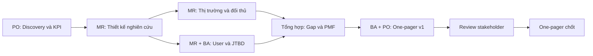

# Workflow: One-pager đầy đủ thị trường và người dùng

Tài liệu mô tả quy trình để tạo **một trang (One-pager)** gồm đủ các khối:

- Market overview
- Market gap
- Current competitor
- User target
- User pain points
- JTBD (Jobs To Be Done)

Workflow bám theo bộ **Agent skills** trong repo: ưu tiên **Senior PO**, **Senior Market Research Specialist**, **Senior BA**; kết hợp **Senior Data Analyst** hoặc **Senior UI/UX** khi cần.

**Mục tiêu:** One-pager có dữ liệu, có thể hành động, chốt được với stakeholder.

---

## 1. Vai trò theo từng giai đoạn

| Giai đoạn                 | Skill chính                        | Việc làm                                                                                  |
| ------------------------- | ---------------------------------- | ----------------------------------------------------------------------------------------- |
| 0 – Khung và ưu tiên      | Senior PO                          | OKR/KPI, problem statement sơ bộ, stakeholder, tiêu chí để quyết định                     |
| 1 – Thiết kế nghiên cứu   | Senior Market Research             | Mục tiêu nghiên cứu đo được, phương pháp (định lượng / định tính / hybrid), cỡ mẫu, nguồn |
| 2 – Thị trường và đối thủ | Senior Market Research             | Xu hướng, TAM/SAM/SOM (hoặc proxy), đối thủ trực tiếp và gián tiếp, ma trận so sánh       |
| 3 – Người dùng và JTBD    | Senior Market Research + Senior BA | Phân khúc, persona, phỏng vấn/khảo sát; JTBD: When / I want to / So I can                 |
| 4 – Gap và cơ hội         | Senior Market Research + Senior PO | Gắn gap với ưu tiên sản phẩm và metric                                                    |
| 5 – Tổng hợp One-pager    | Senior BA + Senior PO              | Một trang: số liệu, insight, giả định, bước tiếp theo                                     |
| (tùy chọn)                | Senior Data Analyst                | Đối chiếu insight với dữ liệu nội bộ                                                      |
| (tùy chọn)                | Senior UI/UX                       | Chuẩn hóa persona/journey cho design                                                      |

**Ghi chú:** Skill **System Architecture Observer** dùng sau khi đã chốt hướng đi (blueprint kỹ thuật), không bắt buộc cho giai đoạn One-pager thị trường.

---

## 2. Luồng tổng thể

---

## 3. Các bước chi tiết

### Bước 0 – Discovery (Senior PO)

- **Input:** Ý tưởng sản phẩm / vùng thị trường / giả thuyết ban đầu.
- **Làm:** Problem statement 1–3 câu; 1–3 KPI/OKR; danh sách stakeholder cần đồng thuận.
- **Output:** Brief nửa trang – “north star” cho toàn bộ research.

### Bước 1 – Thiết kế nghiên cứu (Senior Market Research)

- **Làm:** Câu hỏi nghiên cứu trả lời được; phương pháp; timeline; lưu ý thiên kiến (objective và unbiased).
- **Output:** Bảng “câu hỏi → nguồn dữ liệu”.

### Bước 2 – Market overview (Senior Market Research)

- **Làm:** Quy mô và tăng trưởng (báo cáo ngành, công cụ thống kê); driver/rào cản; xu hướng 12–36 tháng. Ghi rõ **giả định** nếu thiếu số công khai.
- **Output:** 5–8 bullet có trích dẫn nguồn (hoặc đánh dấu “internal only”).

### Bước 3 – Current competitor (Senior Market Research)

- **Làm:** 3–5 đối thủ chính (trực tiếp + gián tiếp). Bảng: positioning, ICP, giá, điểm khác biệt, điểm yếu (review/UX). Có thể SWOT ngắn.
- **Output:** **Feature / value parity map** (theo checklist trong skill Market Research).

### Bước 4 – User target (Senior Market Research + Senior BA)

- **Làm:** Phân khúc (B2B/B2C, firmographic/demographic, hành vi). Persona primary/secondary. Tiêu chí “ai không phải user” để tránh scope creep.
- **Output:** 1 persona chính + 1 phụ; có quote từ phỏng vấn nếu có.

### Bước 5 – User pain points (Senior Market Research)

- **Làm:** Pain gắn **bối cảnh** (khi nào, tần suất, hậu quả). Phân loại must-fix vs nice-to-have. Ưu tiên có **bằng chứng** (số hoặc trích dẫn).
- **Output:** 5–7 pain; mỗi pain: evidence + impact.

### Bước 6 – JTBD (Senior BA + Senior Market Research)

- **Làm:** Với mỗi persona chính, 2–4 câu theo khung:
  - **When** [tình huống]
  - **I want to** [kết quả mong muốn]
  - **So I can** [outcome cấp cao]
- Có thể tách functional / emotional / social job nếu hữu ích.
- **Output:** Bảng Persona × JTBD; workaround hiện tại của user.

### Bước 7 – Market gap (Senior Market Research + Senior PO)

- **Làm:** Từ “jobs chưa được phục vụ tốt” và “điểm yếu đối thủ” suy ra gap có thể bảo vệ; **why now**.
- **Output:** 3–5 gap: ai đau, vì sao đối thủ chưa lấp đầy, cơ hội cho đội mình.

### Bước 8 – Tổng hợp One-pager (Senior BA + Senior PO)

- **Làm:** Gom vào **một trang** (A4/Letter hoặc một slide dày). Cuối: **3–5 insight chính** + **3–5 hành động cụ thể** (actionable).
- **Output:** Bản chốt sau review stakeholder.

---

## 4. Khung nội dung One-pager (thứ tự đọc)

1. **Tiêu đề và one-liner** – Sản phẩm / vùng thị trường + đề xuất giá trị trong một câu.
2. **Market overview**
3. **Market gap**
4. **Current competitor**
5. **User target**
6. **User pain points**
7. **JTBD** (bảng When / want / so I can)
8. **Insight chính và đề xuất**
9. **Giả định và câu hỏi mở**
10. **Nguồn và phương pháp** (sample size, loại nghiên cứu)

---

## 5. Checklist chất lượng (rút từ skills)

- **Senior PO:** Problem gắn KPI; insight dẫn tới quyết định ưu tiên, không mô tả chung chung.
- **Senior Market Research:** Nhận định quan trọng có số hoặc quote; ít nhất 3 đối thủ phân tích sâu; có ma trận so sánh; có persona + pain; có 3–5 insight + đề xuất.
- **Senior BA:** Thuật ngữ nhất quán; JTBD không trùng mơ hồ với pain (pain = vấn đề; JTBD = “công việc” user thuê sản phẩm làm trong bối cảnh cụ thể).

---

## 6. Cách chạy với Agents trong Cursor

1. Gọi skill **Senior PO** – chốt brief discovery + KPI.
2. Gọi **Senior Market Research** – thiết kế research + đối thủ + thị trường.
3. Gọi **Senior BA** – persona, bảng JTBD, khung One-pager.
4. Vòng **Senior PO** – rà market gap vs roadmap và chốt bản cuối.

---

## 7. Ghi chú kỹ thuật (encoding)

Khi chia sẻ file: lưu **UTF-8**. Nếu copy vào công cụ khác mà ký tự tiếng Việt sai, kiểm tra encoding bước paste/export (tránh ANSI / Windows-1252).