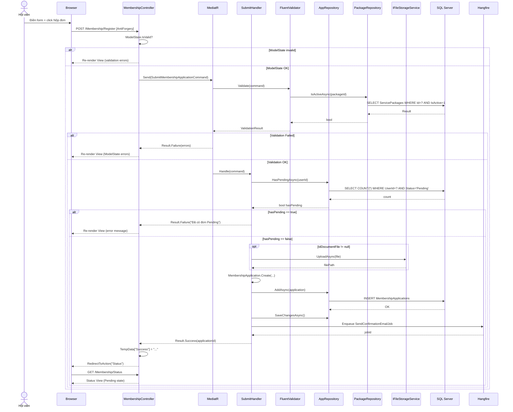
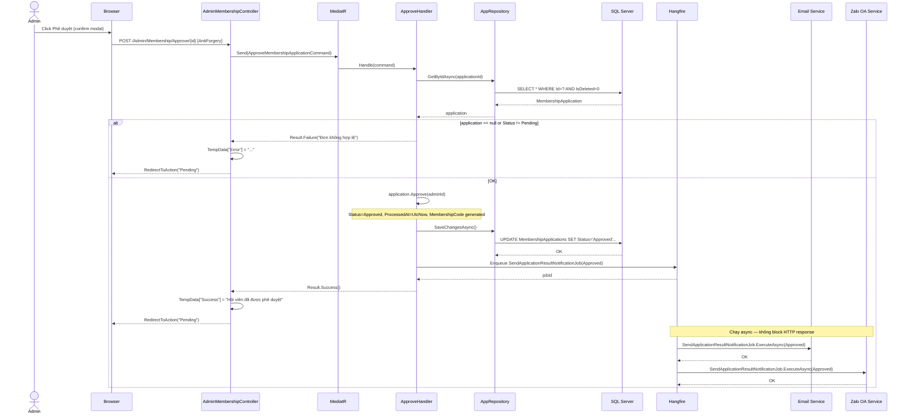
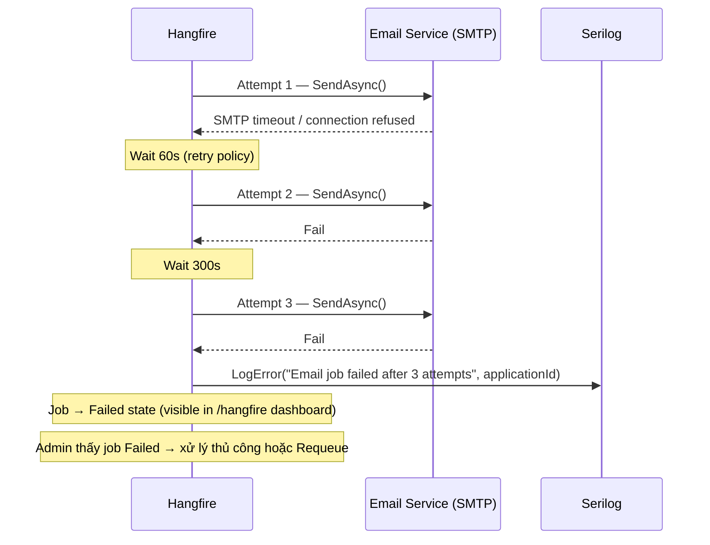

# API Specification & Sequence Diagrams — FEAT-001

---

## Luồng 4A — API Contract Chi Tiết

### Quy ước chung

| Quy ước | Giá trị |
|---------|---------|
| Auth | ASP.NET Core Identity Cookie |
| CSRF | `[ValidateAntiForgeryToken]` trên tất cả POST |
| Error format | MVC ModelState (form re-render) hoặc TempData redirect |
| Success redirect | PRG Pattern → `RedirectToAction` + `TempData` |
| Pagination | `?page=1&pageSize=20` (default) |

---

### Endpoint 1 — GET `/ServicePackage`

```
Controller : ServicePackageController.Index
Auth       : [AllowAnonymous]
```

**Response ViewModel:**
```csharp
public class ServicePackageListViewModel
{
    public List<ServicePackageCardViewModel> Packages { get; set; } = [];
}

public class ServicePackageCardViewModel
{
    public Guid Id { get; set; }
    public string Name { get; set; }
    public string? Description { get; set; }
    public decimal Price { get; set; }
    public int DurationMonths { get; set; }
    public List<string> Benefits { get; set; } = [];    // deserialized từ JSON
    public bool IsPopular { get; set; }                  // DisplayOrder == 2
}
```

**Controller:**
```csharp
[AllowAnonymous]
public async Task<IActionResult> Index()
{
    var packages = await _mediator.Send(new GetActivePackagesQuery());
    return View(new ServicePackageListViewModel { Packages = packages });
}
```

**Error states:** Nếu không có gói active → trả View với empty list (hiển thị empty state message).

---

### Endpoint 2 — GET `/Membership/Register`

```
Controller : MembershipController.Register
Auth       : [Authorize]
QueryParam : packageId (Guid, optional)
```

**Business logic GET:**
1. Check `HasPendingApplicationAsync(userId)` → nếu `true`: `RedirectToAction("Status")`.
2. Nếu `packageId` hợp lệ: pre-fill `ServicePackageId` trong form model.
3. Load danh sách packages active để render select dropdown.

**Response ViewModel:**
```csharp
public class MembershipRegisterFormModel
{
    [Required(ErrorMessage = "Vui lòng nhập họ và tên.")]
    [MaxLength(100)]
    [Display(Name = "Họ và tên")]
    public string FullName { get; set; }

    [Required(ErrorMessage = "Vui lòng nhập ngày sinh.")]
    [Display(Name = "Ngày sinh")]
    public DateOnly DateOfBirth { get; set; }

    [Required(ErrorMessage = "Vui lòng nhập số điện thoại.")]
    [RegularExpression(@"^0\d{9}$", ErrorMessage = "Số điện thoại gồm 10 chữ số, bắt đầu bằng 0.")]
    [Display(Name = "Số điện thoại")]
    public string PhoneNumber { get; set; }

    [Required(ErrorMessage = "Vui lòng nhập địa chỉ.")]
    [MaxLength(300)]
    [Display(Name = "Địa chỉ")]
    public string Address { get; set; }

    [Required(ErrorMessage = "Vui lòng chọn gói dịch vụ.")]
    [Display(Name = "Gói dịch vụ")]
    public Guid ServicePackageId { get; set; }

    [MaxLength(500)]
    [Display(Name = "Ghi chú")]
    public string? Notes { get; set; }

    [Display(Name = "CMND/CCCD (tùy chọn)")]
    public IFormFile? IdDocumentFile { get; set; }

    // For rendering select dropdown (not bound from POST)
    public List<SelectListItem> AvailablePackages { get; set; } = [];
}
```

---

### Endpoint 3 — POST `/Membership/Register`

```
Controller : MembershipController.Register [POST]
Auth       : [Authorize]
CSRF       : [ValidateAntiForgeryToken]
```

**FluentValidation (Application layer):**
```csharp
// src/SkillNet.Application/Features/Membership/Commands/Submit/SubmitMembershipApplicationValidator.cs
public class SubmitMembershipApplicationValidator : AbstractValidator<SubmitMembershipApplicationCommand>
{
    public SubmitMembershipApplicationValidator(IServicePackageRepository packageRepo)
    {
        RuleFor(x => x.FullName)
            .NotEmpty().WithMessage("Vui lòng nhập họ và tên.")
            .MaximumLength(100);

        RuleFor(x => x.DateOfBirth)
            .NotEmpty()
            .Must(dob => DateTime.UtcNow.Year - dob.Year >= 16)
            .WithMessage("Bạn phải đủ 16 tuổi để đăng ký.");

        RuleFor(x => x.PhoneNumber)
            .NotEmpty()
            .Matches(@"^0\d{9}$").WithMessage("Số điện thoại gồm 10 chữ số, bắt đầu bằng 0.");

        RuleFor(x => x.Address)
            .NotEmpty().WithMessage("Vui lòng nhập địa chỉ.")
            .MinimumLength(5).MaximumLength(300);

        RuleFor(x => x.ServicePackageId)
            .NotEmpty()
            .MustAsync(async (id, ct) => await packageRepo.IsActiveAsync(id, ct))
            .WithMessage("Gói dịch vụ không hợp lệ hoặc không còn hoạt động.");

        When(x => x.Notes != null, () =>
            RuleFor(x => x.Notes).MaximumLength(500));

        When(x => x.IdDocumentFile != null, () =>
        {
            RuleFor(x => x.IdDocumentFile!.Length)
                .LessThanOrEqualTo(5 * 1024 * 1024)
                .WithMessage("File không được vượt quá 5MB.");
            RuleFor(x => x.IdDocumentFile!.ContentType)
                .Must(ct => new[] { "image/jpeg", "image/png", "application/pdf" }.Contains(ct))
                .WithMessage("Chỉ chấp nhận file jpg, png hoặc pdf.");
        });
    }
}
```

**Handler:**
```csharp
// src/SkillNet.Application/Features/Membership/Commands/Submit/SubmitMembershipApplicationHandler.cs
public class SubmitMembershipApplicationHandler(
    IMembershipApplicationRepository appRepo,
    IServicePackageRepository packageRepo,
    IFileStorageService fileStorage,
    IBackgroundJobClient backgroundJobs) : IRequestHandler<SubmitMembershipApplicationCommand, Result<Guid>>
{
    public async Task<Result<Guid>> Handle(SubmitMembershipApplicationCommand cmd, CancellationToken ct)
    {
        // Business rule: không có đơn Pending đang tồn tại
        if (await appRepo.HasPendingAsync(cmd.UserId, ct))
            return Result.Failure<Guid>("Bạn đã có đơn đăng ký đang chờ xét duyệt.");

        // Upload file nếu có
        string? documentPath = null;
        if (cmd.IdDocumentFile is not null)
            documentPath = await fileStorage.UploadAsync(cmd.IdDocumentFile, "id-documents", ct);

        var application = MembershipApplication.Create(
            cmd.UserId, cmd.ServicePackageId,
            cmd.FullName, cmd.DateOfBirth,
            cmd.PhoneNumber, cmd.Address,
            cmd.Notes, documentPath);

        await appRepo.AddAsync(application, ct);
        await appRepo.SaveChangesAsync(ct);

        // Enqueue email xác nhận (async — không block HTTP response)
        backgroundJobs.Enqueue<SendApplicationConfirmationEmailJob>(
            job => job.ExecuteAsync(application.Id, cmd.UserEmail, cmd.UserName, cmd.PackageName));

        return Result.Success(application.Id);
    }
}
```

**Controller POST:**
```csharp
[HttpPost, ValidateAntiForgeryToken]
public async Task<IActionResult> Register(MembershipRegisterFormModel form)
{
    if (!ModelState.IsValid)
    {
        form.AvailablePackages = await LoadPackageSelectListAsync();
        return View(form);
    }

    var cmd = new SubmitMembershipApplicationCommand(
        UserId: User.FindFirstValue(ClaimTypes.NameIdentifier)!,
        UserEmail: User.FindFirstValue(ClaimTypes.Email)!,
        UserName: User.FindFirstValue(ClaimTypes.Name)!,
        ServicePackageId: form.ServicePackageId,
        FullName: form.FullName,
        DateOfBirth: form.DateOfBirth,
        PhoneNumber: form.PhoneNumber,
        Address: form.Address,
        Notes: form.Notes,
        IdDocumentFile: form.IdDocumentFile,
        PackageName: ""   // resolved in handler from packageRepo
    );

    var result = await _mediator.Send(cmd);

    if (result.IsFailure)
    {
        ModelState.AddModelError(string.Empty, result.Error);
        form.AvailablePackages = await LoadPackageSelectListAsync();
        return View(form);
    }

    TempData["Success"] = "Đơn đăng ký của bạn đã được gửi. Ban quản lý sẽ xét duyệt trong 1–2 ngày làm việc.";
    return RedirectToAction(nameof(Status));
}
```

**Error Codes:**

| Scenario | HTTP | Behavior |
|----------|------|---------|
| ModelState invalid | 200 | Re-render form với errors |
| Business rule: has Pending | 200 | ModelState error + re-render |
| ServicePackage inactive | 200 | Validator error on `ServicePackageId` |
| File too large / wrong type | 200 | Validator error on `IdDocumentFile` |
| Unexpected server error | 500 | Global exception handler → `/Error` |

---

### Endpoint 4 — GET `/Membership/Status`

```
Controller : MembershipController.Status
Auth       : [Authorize]
```

```csharp
public class ApplicationStatusViewModel
{
    public bool HasApplication { get; set; }
    public Guid? ApplicationId { get; set; }
    public ApplicationStatus? Status { get; set; }
    public string? ServicePackageName { get; set; }
    public decimal? ServicePackagePrice { get; set; }
    public string? MembershipCode { get; set; }
    public DateTime? CreatedAt { get; set; }
    public DateTime? ProcessedAt { get; set; }
    public string? RejectionReason { get; set; }
    public int? DaysPending { get; set; }   // để hiển thị "đang chờ X ngày"
}
```

---

### Endpoint 5 — POST `/Admin/Membership/Approve/{id}`

```
Controller : AdminMembershipController.Approve
Auth       : [Authorize(Roles = "Admin")]
CSRF       : [ValidateAntiForgeryToken]
```

```csharp
[HttpPost, ValidateAntiForgeryToken]
[Authorize(Roles = "Admin")]
public async Task<IActionResult> Approve(Guid id)
{
    var cmd = new ApproveMembershipApplicationCommand(
        ApplicationId: id,
        AdminId: User.FindFirstValue(ClaimTypes.NameIdentifier)!);

    var result = await _mediator.Send(cmd);

    TempData[result.IsSuccess ? "Success" : "Error"] = result.IsSuccess
        ? "Hội viên đã được phê duyệt thành công."
        : result.Error;

    return RedirectToAction(nameof(Pending));
}
```

---

### Endpoint 6 — POST `/Admin/Membership/Reject/{id}`

```
Controller : AdminMembershipController.Reject
Auth       : [Authorize(Roles = "Admin")]
CSRF       : [ValidateAntiForgeryToken]
```

```csharp
public class RejectApplicationFormModel
{
    [Required(ErrorMessage = "Vui lòng nhập lý do từ chối.")]
    [MaxLength(1000)]
    [Display(Name = "Lý do từ chối")]
    public string RejectionReason { get; set; }
}
```

---

## Luồng 4B — Sequence Diagrams (Mermaid)

### Diagram 1: Submit Application



### Diagram 2: Admin Approve



### Diagram 3: Zalo/Email Fail & Retry


