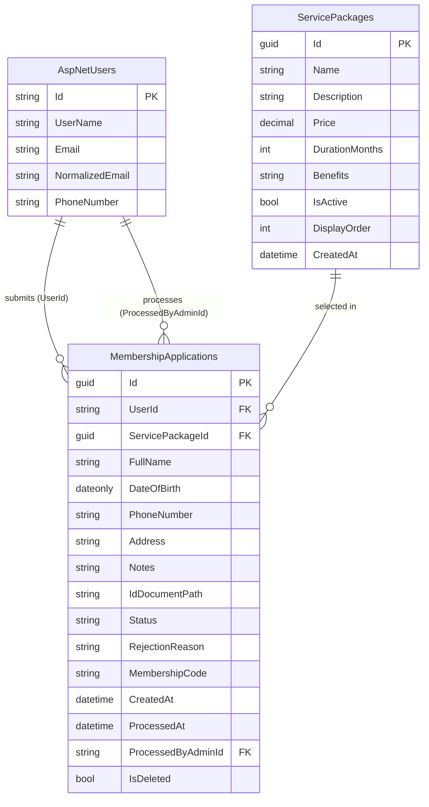

# Database Schema & Integration Design — FEAT-001

---

## 3A. EF Core Entities

### Entity: `MembershipApplication`

```csharp
// src/SkillNet.Domain/Entities/MembershipApplication.cs
public class MembershipApplication
{
    public Guid Id { get; private set; }
    public string UserId { get; private set; }
    public Guid ServicePackageId { get; private set; }

    // Personal info (captured at time of application — không dùng User profile)
    public string FullName { get; private set; }
    public DateOnly DateOfBirth { get; private set; }
    public string PhoneNumber { get; private set; }
    public string Address { get; private set; }
    public string? Notes { get; private set; }
    public string? IdDocumentPath { get; private set; }

    // Status
    public ApplicationStatus Status { get; private set; }
    public string? RejectionReason { get; private set; }
    public string? MembershipCode { get; private set; }     // generated khi Approved

    // Audit
    public DateTime CreatedAt { get; private set; }
    public DateTime? ProcessedAt { get; private set; }
    public string? ProcessedByAdminId { get; private set; }
    public bool IsDeleted { get; private set; }

    // Navigation
    public ServicePackage ServicePackage { get; private set; } = null!;

    // Factory method — không dùng public constructor
    public static MembershipApplication Create(
        string userId, Guid servicePackageId,
        string fullName, DateOnly dateOfBirth,
        string phoneNumber, string address,
        string? notes, string? idDocumentPath)
    {
        return new MembershipApplication
        {
            Id                = Guid.NewGuid(),
            UserId            = userId,
            ServicePackageId  = servicePackageId,
            FullName          = fullName,
            DateOfBirth       = dateOfBirth,
            PhoneNumber       = phoneNumber,
            Address           = address,
            Notes             = notes,
            IdDocumentPath    = idDocumentPath,
            Status            = ApplicationStatus.Pending,
            CreatedAt         = DateTime.UtcNow,
            IsDeleted         = false
        };
    }

    public void Approve(string adminId)
    {
        if (Status != ApplicationStatus.Pending)
            throw new InvalidOperationException("Chỉ có thể phê duyệt đơn đang Pending.");

        Status               = ApplicationStatus.Approved;
        ProcessedAt          = DateTime.UtcNow;
        ProcessedByAdminId   = adminId;
        MembershipCode       = GenerateMembershipCode();
    }

    public void Reject(string adminId, string reason)
    {
        if (Status != ApplicationStatus.Pending)
            throw new InvalidOperationException("Chỉ có thể từ chối đơn đang Pending.");

        Status               = ApplicationStatus.Rejected;
        RejectionReason      = reason;
        ProcessedAt          = DateTime.UtcNow;
        ProcessedByAdminId   = adminId;
    }

    public void Cancel()
    {
        if (Status != ApplicationStatus.Pending)
            throw new InvalidOperationException("Chỉ có thể hủy đơn đang Pending.");

        Status = ApplicationStatus.Cancelled;
    }

    private static string GenerateMembershipCode()
        => $"QMV-{DateTime.UtcNow:yyyyMM}-{Random.Shared.Next(1000, 9999)}";
}
```

### Entity: `ServicePackage`

```csharp
// src/SkillNet.Domain/Entities/ServicePackage.cs
public class ServicePackage
{
    public Guid Id { get; private set; }
    public string Name { get; private set; }
    public string? Description { get; private set; }
    public decimal Price { get; private set; }
    public int DurationMonths { get; private set; }
    public string Benefits { get; private set; }     // JSON array: ["Ưu đãi A", "Ưu đãi B"]
    public bool IsActive { get; private set; }
    public int DisplayOrder { get; private set; }
    public DateTime CreatedAt { get; private set; }

    public ICollection<MembershipApplication> Applications { get; private set; } = [];
}
```

### Enum: `ApplicationStatus`

```csharp
// src/SkillNet.Domain/Enums/ApplicationStatus.cs
public enum ApplicationStatus
{
    Pending   = 0,
    Approved  = 1,
    Rejected  = 2,
    Cancelled = 3
}
```

---

## 3A. EF Core — Fluent API Configurations

### `MembershipApplicationConfiguration`

```csharp
// src/SkillNet.Infrastructure/Persistence/Configurations/MembershipApplicationConfiguration.cs
public class MembershipApplicationConfiguration : IEntityTypeConfiguration<MembershipApplication>
{
    public void Configure(EntityTypeBuilder<MembershipApplication> builder)
    {
        builder.ToTable("MembershipApplications");
        builder.HasKey(x => x.Id);

        builder.Property(x => x.UserId).IsRequired().HasMaxLength(450);
        builder.Property(x => x.FullName).IsRequired().HasMaxLength(100);
        builder.Property(x => x.PhoneNumber).IsRequired().HasMaxLength(15);
        builder.Property(x => x.Address).IsRequired().HasMaxLength(300);
        builder.Property(x => x.Notes).HasMaxLength(500);
        builder.Property(x => x.IdDocumentPath).HasMaxLength(500);
        builder.Property(x => x.RejectionReason).HasMaxLength(1000);
        builder.Property(x => x.MembershipCode).HasMaxLength(20);
        builder.Property(x => x.ProcessedByAdminId).HasMaxLength(450);

        // Enum → string (dễ đọc trong DB, không mất ý nghĩa khi rename)
        builder.Property(x => x.Status)
               .HasConversion<string>()
               .HasMaxLength(20)
               .IsRequired();

        builder.Property(x => x.Price)
               .HasColumnType("decimal(18,2)");

        // FK
        builder.HasOne(x => x.ServicePackage)
               .WithMany(sp => sp.Applications)
               .HasForeignKey(x => x.ServicePackageId)
               .OnDelete(DeleteBehavior.Restrict);

        // Indexes
        builder.HasIndex(x => x.UserId);
        builder.HasIndex(x => x.Status);
        builder.HasIndex(x => new { x.UserId, x.Status });   // check Pending by user
        builder.HasIndex(x => x.MembershipCode).IsUnique().HasFilter("[MembershipCode] IS NOT NULL");

        // Soft delete global filter
        builder.HasQueryFilter(x => !x.IsDeleted);
    }
}
```

### `ServicePackageConfiguration`

```csharp
// src/SkillNet.Infrastructure/Persistence/Configurations/ServicePackageConfiguration.cs
public class ServicePackageConfiguration : IEntityTypeConfiguration<ServicePackage>
{
    public void Configure(EntityTypeBuilder<ServicePackage> builder)
    {
        builder.ToTable("ServicePackages");
        builder.HasKey(x => x.Id);

        builder.Property(x => x.Name).IsRequired().HasMaxLength(100);
        builder.Property(x => x.Description).HasMaxLength(2000);
        builder.Property(x => x.Price).HasColumnType("decimal(18,2)").IsRequired();
        builder.Property(x => x.DurationMonths).IsRequired();
        builder.Property(x => x.Benefits).IsRequired().HasMaxLength(4000);   // JSON string

        builder.HasIndex(x => x.IsActive);
        builder.HasIndex(x => x.DisplayOrder);
    }
}
```

---

## 3A. Migration Script

```bash
# Tạo migration
dotnet ef migrations add AddMembershipRegistrationFeature \
  --project src/SkillNet.Infrastructure \
  --startup-project src/SkillNet.Web

# Preview SQL (idempotent)
dotnet ef migrations script --idempotent \
  --project src/SkillNet.Infrastructure \
  --startup-project src/SkillNet.Web \
  --output .db/seeds/AddMembershipRegistrationFeature.sql

# Apply lên DB
dotnet ef database update \
  --project src/SkillNet.Infrastructure \
  --startup-project src/SkillNet.Web
```

**Seed data (cho Development):**
```csharp
// src/SkillNet.Infrastructure/Persistence/Seeds/ServicePackageSeed.cs
public static class ServicePackageSeed
{
    public static void Seed(ModelBuilder builder)
    {
        builder.Entity<ServicePackage>().HasData(
            new { Id = Guid.Parse("..."), Name = "Tiêu chuẩn",
                  Price = 500_000m, DurationMonths = 12,
                  Benefits = "[\"Tham gia sự kiện hội viên\",\"Newsletter hàng tháng\"]",
                  IsActive = true, DisplayOrder = 1, CreatedAt = new DateTime(2026,1,1,0,0,0,DateTimeKind.Utc) },
            new { Id = Guid.Parse("..."), Name = "Nâng cao",
                  Price = 1_200_000m, DurationMonths = 12,
                  Benefits = "[\"Tất cả quyền lợi Tiêu chuẩn\",\"Ưu tiên đăng ký khoá học\",\"1-on-1 mentoring/quý\"]",
                  IsActive = true, DisplayOrder = 2, CreatedAt = new DateTime(2026,1,1,0,0,0,DateTimeKind.Utc) },
            new { Id = Guid.Parse("..."), Name = "VIP",
                  Price = 3_000_000m, DurationMonths = 12,
                  Benefits = "[\"Tất cả quyền lợi Nâng cao\",\"Badge VIP\",\"Truy cập tài liệu độc quyền\",\"Hỗ trợ ưu tiên 24/7\"]",
                  IsActive = true, DisplayOrder = 3, CreatedAt = new DateTime(2026,1,1,0,0,0,DateTimeKind.Utc) }
        );
    }
}
```

---

## 3A. ERD (Mermaid)



---

## 3B. Hangfire Jobs — Integration Services

### Job 1: Xác nhận đơn đã nhận

```csharp
// src/SkillNet.Infrastructure/Jobs/SendApplicationConfirmationEmailJob.cs
public class SendApplicationConfirmationEmailJob(IEmailService emailService, ILogger<SendApplicationConfirmationEmailJob> logger)
{
    [AutomaticRetry(Attempts = 3, DelaysInSeconds = [60, 300, 900])]
    public async Task ExecuteAsync(Guid applicationId, string userEmail, string userName, string packageName)
    {
        logger.LogInformation("Sending confirmation email for application {ApplicationId}", applicationId);

        await emailService.SendAsync(new EmailMessage
        {
            To      = userEmail,
            Subject = $"Đã nhận đơn đăng ký hội viên của bạn — QMV",
            Body    = EmailTemplates.ApplicationConfirmation(userName, packageName, applicationId)
        });
    }
}

// Enqueue từ SubmitMembershipApplicationHandler:
BackgroundJob.Enqueue<SendApplicationConfirmationEmailJob>(
    job => job.ExecuteAsync(application.Id, user.Email!, user.UserName!, package.Name));
```

### Job 2: Thông báo kết quả (Approved / Rejected)

```csharp
// src/SkillNet.Infrastructure/Jobs/SendApplicationResultNotificationJob.cs
public class SendApplicationResultNotificationJob(
    IEmailService emailService,
    IZaloOAService zaloService,
    ILogger<SendApplicationResultNotificationJob> logger)
{
    [AutomaticRetry(Attempts = 3, DelaysInSeconds = [60, 300, 900])]
    public async Task ExecuteAsync(Guid applicationId, string userEmail, string userName,
        string packageName, string membershipCode, ApplicationStatus status, string? rejectionReason,
        string? userPhone)
    {
        // Gửi Email
        var emailBody = status == ApplicationStatus.Approved
            ? EmailTemplates.ApplicationApproved(userName, packageName, membershipCode)
            : EmailTemplates.ApplicationRejected(userName, packageName, rejectionReason!);

        await emailService.SendAsync(new EmailMessage
        {
            To      = userEmail,
            Subject = status == ApplicationStatus.Approved
                ? "🎉 Chúc mừng! Bạn đã chính thức trở thành Hội viên QMV"
                : "Thông báo về đơn đăng ký hội viên của bạn",
            Body    = emailBody
        });

        // Gửi Zalo OA (nếu có số điện thoại)
        if (!string.IsNullOrEmpty(userPhone))
        {
            var zaloMessage = status == ApplicationStatus.Approved
                ? ZaloTemplates.ApplicationApproved(userName, packageName, membershipCode)
                : ZaloTemplates.ApplicationRejected(userName, rejectionReason!);

            await zaloService.SendMessageAsync(userPhone, zaloMessage);
        }
    }
}
```

### Job 3: Nhắc Admin (Recurring — hàng ngày)

```csharp
// src/SkillNet.Infrastructure/Jobs/RemindAdminPendingApplicationsJob.cs
public class RemindAdminPendingApplicationsJob(
    IMembershipApplicationRepository repo,
    IEmailService emailService,
    IOptions<AdminNotificationOptions> options)
{
    // Đăng ký trong Program.cs:
    // RecurringJob.AddOrUpdate<RemindAdminPendingApplicationsJob>(
    //     "remind-admin-pending", job => job.ExecuteAsync(), Cron.Daily(8));  // 8h sáng UTC+7

    public async Task ExecuteAsync()
    {
        var overduePending = await repo.GetPendingOlderThanAsync(days: 3);
        if (!overduePending.Any()) return;

        await emailService.SendAsync(new EmailMessage
        {
            To      = options.Value.AdminEmail,
            Subject = $"[QMV] {overduePending.Count} đơn hội viên chờ duyệt quá 3 ngày",
            Body    = EmailTemplates.AdminPendingReminder(overduePending)
        });
    }
}
```

---

## 3B. Email Templates

```csharp
// src/SkillNet.Infrastructure/Templates/EmailTemplates.cs
public static class EmailTemplates
{
    public static string ApplicationConfirmation(string userName, string packageName, Guid appId) => $"""
        <h2>Xin chào {userName},</h2>
        <p>Chúng tôi đã nhận được đơn đăng ký hội viên gói <strong>{packageName}</strong> của bạn.</p>
        <p>✅ Ban quản lý sẽ xem xét và phản hồi trong vòng <strong>1–2 ngày làm việc</strong>.</p>
        <p>Mã tham chiếu: <code>{appId}</code></p>
        <p>Nếu có thắc mắc, liên hệ: <a href="mailto:support@qmv.com">support@qmv.com</a></p>
        <p>Trân trọng,<br/>Ban Quản lý QMV</p>
        """;

    public static string ApplicationApproved(string userName, string packageName, string code) => $"""
        <h2>🎉 Chúc mừng {userName}!</h2>
        <p>Đơn đăng ký hội viên của bạn đã được <strong>PHÊ DUYỆT</strong>.</p>
        <table>
            <tr><td>Mã hội viên:</td><td><strong>{code}</strong></td></tr>
            <tr><td>Gói dịch vụ:</td><td>{packageName}</td></tr>
        </table>
        <p><a href="https://qmv.com/Membership/Status">Đăng nhập để xem quyền lợi →</a></p>
        <p>Trân trọng,<br/>Ban Quản lý QMV</p>
        """;

    public static string ApplicationRejected(string userName, string packageName, string reason) => $"""
        <h2>Xin chào {userName},</h2>
        <p>Sau khi xem xét, đơn đăng ký hội viên gói <strong>{packageName}</strong> của bạn <strong>chưa đủ điều kiện</strong>.</p>
        <p><strong>Lý do:</strong> {reason}</p>
        <p>Bạn có thể nộp lại đơn sau khi cập nhật thông tin.</p>
        <p>Liên hệ hỗ trợ: <a href="mailto:support@qmv.com">support@qmv.com</a></p>
        <p>Trân trọng,<br/>Ban Quản lý QMV</p>
        """;

    public static string AdminPendingReminder(IList<MembershipApplication> apps) => $"""
        <p>Có <strong>{apps.Count} đơn</strong> đăng ký hội viên chưa được xử lý quá 3 ngày:</p>
        <ul>
            {string.Join("", apps.Select(a => $"<li>{a.FullName} — Gói {a.ServicePackage.Name} — {(DateTime.UtcNow - a.CreatedAt).Days} ngày</li>"))}
        </ul>
        <p><a href="https://qmv.com/Admin/Membership/Pending">Xem và xử lý ngay →</a></p>
        """;
}
```

---

## 3B. Zalo OA Templates

```csharp
// src/SkillNet.Infrastructure/Templates/ZaloTemplates.cs
public static class ZaloTemplates
{
    // Zalo OA ZNS (Zalo Notification Service) — template đã được QMV đăng ký với Zalo
    // Template ID được lưu trong appsettings / User Secrets: Zalo:ApprovedTemplateId

    public static ZaloZnsMessage ApplicationApproved(string userName, string packageName, string code) => new()
    {
        TemplateId = "APPROVED_TEMPLATE_ID",    // từ appsettings
        TemplateData = new Dictionary<string, string>
        {
            ["user_name"]      = userName,
            ["package_name"]   = packageName,
            ["membership_code"] = code
        }
    };

    public static ZaloZnsMessage ApplicationRejected(string userName, string reason) => new()
    {
        TemplateId = "REJECTED_TEMPLATE_ID",
        TemplateData = new Dictionary<string, string>
        {
            ["user_name"]        = userName,
            ["rejection_reason"] = reason
        }
    };
}
```

---

## 3B. Hangfire Registration (Program.cs)

```csharp
// src/SkillNet.Web/Program.cs — thêm vào Hangfire setup
app.UseHangfireDashboard("/hangfire", new DashboardOptions
{
    Authorization = [new HangfireAuthorizationFilter()]  // chỉ Admin
});

// Recurring job: nhắc Admin lúc 8h sáng (UTC+7 = 1h UTC)
RecurringJob.AddOrUpdate<RemindAdminPendingApplicationsJob>(
    recurringJobId: "remind-admin-pending-applications",
    methodCall: job => job.ExecuteAsync(),
    cronExpression: "0 1 * * *",   // 08:00 ICT daily
    timeZone: TimeZoneInfo.Utc);
```
