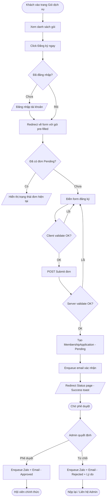

# ĐẶC TẢ YÊU CẦU CHỨC NĂNG (SRS)
## FEAT-001 — Đăng ký Hội viên mới

---

## 1. Thông tin chung

| Thuộc tính | Giá trị |
|-----------|---------|
| **Tên chức năng** | Đăng ký Hội viên mới (Member Registration) |
| **Feature ID** | FEAT-001 |
| **Tác nhân chính** | Hội viên tiềm năng (Guest / User chưa có tư cách hội viên) |
| **Tác nhân phụ** | Admin (Ban quản lý) |
| **Mục tiêu** | Cho phép người dùng tự đăng ký hội viên online, chọn gói dịch vụ, và theo dõi trạng thái xét duyệt — thay thế hoàn toàn quy trình giấy tờ/Excel hiện tại |
| **KPI thành công** | Funnel conversion `register_viewed → succeeded` ≥ 70%; Time to Approve ≤ 3 ngày |

---

## 2. User Stories

### US-001 — Hội viên tiềm năng đăng ký
**Là một** người dùng chưa có tư cách hội viên,  
**tôi muốn** điền form đăng ký và chọn gói dịch vụ phù hợp,  
**để tôi có thể** trở thành hội viên chính thức và hưởng quyền lợi tương ứng.

### US-002 — Admin xét duyệt đơn
**Là một** Admin (Ban quản lý),  
**tôi muốn** xem danh sách đơn đăng ký đang chờ duyệt và phê duyệt hoặc từ chối từng đơn,  
**để tôi có thể** kiểm soát chất lượng hội viên và phản hồi kịp thời.

### US-003 — Hội viên theo dõi trạng thái
**Là một** người đã nộp đơn,  
**tôi muốn** biết trạng thái đơn đăng ký của mình (Pending / Approved / Rejected),  
**để tôi có thể** biết mình cần làm gì tiếp theo.

---

## 3. Yêu cầu chức năng

| ID | Tính năng | Mô tả chi tiết |
|:--:|-----------|---------------|
| **F1** | Xem danh sách gói dịch vụ | Trang public `/ServicePackage` hiển thị các gói hội viên đang active: tên, giá, thời hạn, quyền lợi. Không yêu cầu đăng nhập. |
| **F2** | Form đăng ký hội viên | Trang `/Membership/Register` (yêu cầu đăng nhập). Form gồm: thông tin cá nhân (họ tên, ngày sinh, số điện thoại, địa chỉ), chọn gói dịch vụ, upload ảnh CMND/CCCD (tùy chọn), ghi chú. |
| **F3** | Submit đơn | POST tạo `MembershipApplication` với status = `Pending`. Validate server-side đầy đủ. |
| **F4** | Giới hạn 1 đơn đang Pending | User không thể nộp đơn mới khi đã có đơn đang `Pending`. Thông báo rõ ràng. |
| **F5** | Email xác nhận submit | Sau khi nộp đơn thành công, hệ thống gửi email xác nhận qua Hangfire (async). |
| **F6** | Trang trạng thái đơn | `/Membership/Status` — user xem đơn hiện tại (status, ngày nộp, lý do từ chối nếu có). |
| **F7** | Admin — Danh sách đơn chờ duyệt | `/Admin/Membership/Pending` — bảng danh sách, sortable, filterable theo ngày/gói. Badge count trên navigation. |
| **F8** | Admin — Xem chi tiết đơn | `/Admin/Membership/Detail/{id}` — xem toàn bộ thông tin, lịch sử. |
| **F9** | Admin — Phê duyệt | POST `/Admin/Membership/Approve/{id}`. Chuyển status → `Approved`, trigger thông báo Zalo OA + Email. |
| **F10** | Admin — Từ chối | POST `/Admin/Membership/Reject/{id}` kèm lý do (required). Chuyển status → `Rejected`, trigger thông báo. |
| **F11** | Thông báo kết quả | Email + Zalo OA gửi kết quả phê duyệt/từ chối qua Hangfire job. |

---

## 4. Yêu cầu phi chức năng

| Nhóm | Tiêu chuẩn kỹ thuật |
|------|---------------------|
| **Performance** | Trang `/Membership/Register` load ≤ 1s (TTFB). POST submit xử lý ≤ 500ms (p95). |
| **Security** | Form có `[ValidateAntiForgeryToken]`. File upload: chỉ chấp nhận jpg/png/pdf, max 5MB, virus scan. Trang Admin yêu cầu role `Admin`. |
| **Reliability** | Email/Zalo gửi qua Hangfire với retry 3 lần. Nếu fail sau 3 lần → log Error + alert admin. |
| **Availability** | 99.5% uptime. Submit form phải thành công ngay cả khi Email/Zalo service down (tách async). |
| **Usability** | Hoàn thành đăng ký ≤ 3 phút. Mobile-first, touch target ≥ 44px. |
| **Accessibility** | WCAG 2.1 AA — form có label rõ ràng, error message gắn với field qua `aria-describedby`. |
| **SEO** | Trang `/ServicePackage` public phải có meta title/description, canonical URL, noindex cho trang `/Membership/Register` (authenticated). |

---

## 5. Luồng sự kiện

### 5.1 Luồng chính — Đăng ký thành công (Happy Path)

1. Hội viên tiềm năng vào trang `/ServicePackage`, xem các gói dịch vụ.
2. Click **"Đăng ký ngay"** trên gói muốn chọn.
3. Nếu chưa đăng nhập → redirect `/Account/Login?returnUrl=/Membership/Register?packageId=X`.
4. Sau đăng nhập → redirect về form đăng ký với gói đã chọn pre-filled.
5. User điền thông tin: họ tên, ngày sinh, số điện thoại, địa chỉ, ghi chú (optional).
6. Client validate (jQuery Validation): highlight field lỗi, hiển thị message bên dưới field.
7. User click **"Nộp đơn đăng ký"**.
8. Hệ thống (server) validate lại toàn bộ dữ liệu.
9. Hệ thống tạo `MembershipApplication` với status = `Pending`, ghi timestamp.
10. Enqueue Hangfire job: gửi email xác nhận.
11. Redirect → `/Membership/Status` với TempData success message: *"Đơn đăng ký của bạn đã được gửi. Ban quản lý sẽ xét duyệt trong 1–2 ngày làm việc."*
12. Background: Admin nhận thông báo mới (PendingApprovalsBadge tăng).

### 5.2 Luồng ngoại lệ

**AF-01 — User đã có đơn Pending:**
- Bước 4: Hệ thống kiểm tra → tìm thấy đơn `Pending` đang tồn tại.
- Redirect về `/Membership/Status` với thông báo: *"Bạn đã có đơn đăng ký đang chờ xét duyệt. Không thể nộp thêm đơn mới."*

**AF-02 — Validation server-side fail:**
- Bước 8: `ModelState.IsValid == false`.
- Trả về View với `ModelState` errors, không tạo application.
- User sửa lại form.

**AF-03 — Admin từ chối đơn:**
- Admin điền lý do từ chối (bắt buộc), click "Từ chối".
- Hệ thống chuyển status → `Rejected`, lưu `RejectionReason`.
- Enqueue Hangfire: gửi email + Zalo thông báo từ chối kèm lý do.
- User vào `/Membership/Status` thấy trạng thái `Rejected` + lý do + CTA "Nộp lại đơn".

**AF-04 — Upload file thất bại (quá 5MB / sai định dạng):**
- Client validate file trước khi submit.
- Server validate lại: trả ModelState error rõ ràng.

### 5.3 User Flow (Mermaid)

---

## 6. Acceptance Criteria (BDD)

### Scenario 1 — Đăng ký thành công
- **Given**: User đã đăng nhập, chưa có đơn Pending, có gói `Standard` đang active
- **When**: User điền đầy đủ thông tin hợp lệ và submit form
- **Then**: Hệ thống tạo `MembershipApplication` với `Status = Pending`
- **And**: User được redirect về `/Membership/Status` với toast success
- **And**: Email xác nhận được enqueue vào Hangfire trong ≤ 5 giây

### Scenario 2 — Chặn double-submit
- **Given**: User đã có đơn `Pending`
- **When**: User cố truy cập `/Membership/Register`
- **Then**: Redirect về `/Membership/Status` với thông báo đơn đang chờ duyệt
- **And**: Không tạo thêm `MembershipApplication` mới

### Scenario 3 — Validation lỗi
- **Given**: User submit form thiếu trường `FullName`
- **When**: Form được submit
- **Then**: Server trả về View với error *"Vui lòng nhập họ và tên"* dưới field
- **And**: Không có `MembershipApplication` nào được tạo

### Scenario 4 — Admin phê duyệt
- **Given**: Admin đăng nhập, có đơn `FEAT-001-2026-001` trạng thái `Pending`
- **When**: Admin click "Phê duyệt" trên chi tiết đơn
- **Then**: Status chuyển sang `Approved`, `ApprovedAt` được ghi
- **And**: Hangfire job gửi email + Zalo OA kết quả được enqueue
- **And**: PendingApprovalsBadge giảm 1

### Scenario 5 — Admin từ chối có lý do
- **Given**: Admin xem đơn đăng ký, quyết định từ chối
- **When**: Admin nhập lý do và click "Từ chối"
- **Then**: Status chuyển sang `Rejected`, `RejectionReason` được lưu
- **And**: User thấy lý do từ chối trên `/Membership/Status`

### Scenario 6 — Unauthorized access
- **Given**: User không có role `Admin` cố truy cập `/Admin/Membership/Pending`
- **When**: Gửi GET request
- **Then**: Redirect về `/Account/Login` hoặc trả 403 Forbidden

---

## 7. Business & Technical Rules

| Phân vùng | Quy tắc |
|-----------|---------|
| **Giới hạn đơn** | 1 user chỉ có tối đa 1 đơn ở trạng thái `Pending` tại 1 thời điểm. Check trước khi tạo mới. |
| **Thay đổi gói** | Sau khi submit, user không thể tự đổi gói. Phải hủy đơn (nếu Pending) và nộp lại. |
| **Hủy đơn** | User có thể hủy đơn `Pending` (chưa được Admin xử lý) qua `/Membership/Cancel/{id}`. |
| **Gia hạn** | FEAT-001 chỉ cover đăng ký mới. Gia hạn sẽ là feature riêng (FEAT-002). |
| **File upload** | Chỉ chấp nhận jpg, jpeg, png, pdf. Max 5MB/file. Lưu vào Azure Blob hoặc `wwwroot/uploads/` (local dev). |
| **Notification** | Email và Zalo KHÔNG gọi trực tiếp trong HTTP handler — bắt buộc qua Hangfire. |
| **Admin role** | Chỉ user có role `Admin` (ASP.NET Core Identity) mới được xem/phê duyệt đơn. |
| **Soft delete** | Không xóa `MembershipApplication` vĩnh viễn — dùng soft delete (`IsDeleted = true`). |
| **Audit trail** | Mọi thay đổi status phải log với timestamp và admin ID. |

---

## 8. UI/UX Specification

### 8.1 Trang `/ServicePackage` (Public)
- Layout: Card grid (3 cột desktop, 1 cột mobile). Mỗi card: tên gói, giá (bold), thời hạn, 3–5 quyền lợi key, CTA `btn-primary` "Đăng ký ngay".
- Gói phổ biến nhất: badge `Phổ biến nhất` (`bg-warning`).
- Empty state (không có gói active): ẩn section, không hiển thị.

### 8.2 Form `/Membership/Register`
- Layout: Single column, max-width 600px, centered.
- Các field:
  - `FullName` — Text, required, max 100 ký tự
  - `DateOfBirth` — Date picker, required, ≥ 16 tuổi
  - `PhoneNumber` — Tel, required, 10 chữ số, bắt đầu bằng 0
  - `Address` — Textarea, required, max 300 ký tự
  - `ServicePackageId` — Select (pre-filled từ query string), required
  - `Notes` — Textarea, optional, max 500 ký tự
  - `IdDocumentFile` — File upload, optional
- Submit button: `btn-primary`, full-width mobile, loading state khi submitting.
- Validation: `asp-validation-for` hiển thị dưới từng field.

### 8.3 Trang `/Membership/Status`
- Hiển thị status badge (Pending = warning, Approved = success, Rejected = danger).
- Pending: hiển thị "Đang chờ xét duyệt" + ngày nộp + thông tin liên hệ nếu cần.
- Approved: hiển thị mã hội viên, gói, ngày hiệu lực.
- Rejected: hiển thị lý do + CTA "Nộp đơn mới".

### 8.4 Admin — `/Admin/Membership/Pending`
- Bảng responsive: Họ tên, gói, ngày nộp, số ngày đang chờ (highlight đỏ nếu > 3 ngày).
- Filter: theo gói, theo ngày. Sort: mặc định theo ngày nộp (mới nhất trước).
- Action: "Xem" link, badge count trên sidebar.

### 8.5 Component States
| Component | States cần thiết kế |
|-----------|-------------------|
| Submit button | Default, Loading (spinner), Disabled |
| Status badge | Pending (yellow), Approved (green), Rejected (red) |
| File upload | Default, Uploading, Success, Error (sai định dạng/quá size) |
| Danh sách Admin | Loading skeleton, Empty ("Không có đơn chờ duyệt"), Error |

---

## 9. Data Dictionary

| Trường | Type | Bắt buộc | Validation | Lưu trữ |
|:------:|:----:|:--------:|:----------:|:-------:|
| `Id` | `Guid` | Auto | — | PK, `MembershipApplications` |
| `UserId` | `string` | Auto | FK → `AspNetUsers.Id` | `MembershipApplications` |
| `ServicePackageId` | `Guid` | Có | FK → `ServicePackages.Id`, package phải active | `MembershipApplications` |
| `FullName` | `string` | Có | 2–100 ký tự, không null | `MembershipApplications` |
| `DateOfBirth` | `DateOnly` | Có | ≥ 16 tuổi, ≤ ngày hiện tại | `MembershipApplications` |
| `PhoneNumber` | `string` | Có | 10 chữ số, bắt đầu bằng 0 | `MembershipApplications` |
| `Address` | `string` | Có | 5–300 ký tự | `MembershipApplications` |
| `Notes` | `string` | Không | Max 500 ký tự | `MembershipApplications` |
| `IdDocumentPath` | `string` | Không | Path đến file, validated mime type | `MembershipApplications` |
| `Status` | `enum` | Auto | `Pending` / `Approved` / `Rejected` / `Cancelled` | `MembershipApplications` |
| `RejectionReason` | `string` | Điều kiện | Required khi Status = `Rejected`, max 1000 ký tự | `MembershipApplications` |
| `CreatedAt` | `DateTime` | Auto | UTC, set lúc tạo | `MembershipApplications` |
| `ProcessedAt` | `DateTime?` | Điều kiện | UTC, set khi Admin xử lý | `MembershipApplications` |
| `ProcessedByAdminId` | `string?` | Điều kiện | FK → `AspNetUsers.Id`, role Admin | `MembershipApplications` |
| `IsDeleted` | `bool` | Auto | Default `false` | `MembershipApplications` |

**ServicePackage (tham chiếu):**

| Trường | Type | Mô tả |
|--------|------|-------|
| `Id` | `Guid` | PK |
| `Name` | `string` | Tên gói: "Tiêu chuẩn", "Nâng cao", "VIP" |
| `Price` | `decimal(18,2)` | Giá VNĐ |
| `DurationMonths` | `int` | Thời hạn (tháng) |
| `Benefits` | `string` | JSON array quyền lợi |
| `IsActive` | `bool` | Chỉ hiển thị gói active |

---

## 10. Tracking Events

| Event | Trigger | Properties |
|-------|---------|-----------|
| `membership_register_viewed` | Load `/Membership/Register` | `{ "package_id": "", "source": "package_list" }` |
| `membership_form_started` | User focus vào field đầu tiên | `{ "package_id": "" }` |
| `membership_form_submitted` | Click Submit | `{ "package_id": "", "package_name": "" }` |
| `membership_register_succeeded` | Redirect về Status page | `{ "application_id": "", "package_id": "" }` |
| `membership_register_failed` | Server validation error | `{ "error_field": "", "error_code": "" }` |
| `membership_register_blocked` | User đã có đơn Pending | `{ "existing_application_id": "" }` |
| `membership_approved` | Admin approve | `{ "application_id": "", "package_id": "", "days_pending": 0 }` |
| `membership_rejected` | Admin reject | `{ "application_id": "", "reject_reason_code": "" }` |
| `package_list_viewed` | Load `/ServicePackage` | `{}` |
| `package_selected` | Click CTA trên card | `{ "package_id": "", "package_name": "", "price": 0 }` |

> **Lưu ý PII**: Không tracking `FullName`, `PhoneNumber`, `Email`, `Address` trong bất kỳ event property nào.
